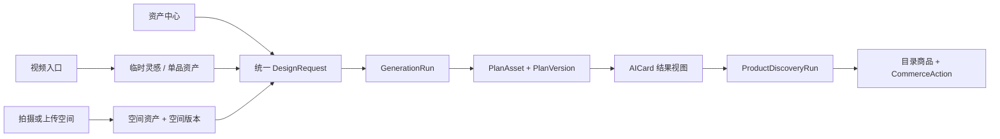

# 抖音展示 Demo → AI 一角焕新 P0：前端工程交接

> 更新日期：2026-07-25
> 读者：前端开发、联调同学、产品验收同学
> 当前成熟度：抖音壳为“运行时静态 Demo”；`renewal.html` 为“可持久联调集成原型”；结果后的商品发现购买承接为“协议完成、真实目录待接”；旧 `me.js` 空间层为“已退出主路径的视觉 Mock”
> 本文用途：说明当前代码事实、已接通边界、剩余范围、状态与验收方式
> 产品依据：产品同学 2026-07 新版《AI 一角焕新：产品蓝图与全链路功能清单》

目标后端接口与实现任务以
[后端下一阶段交接](../../docs/backend-next-phase-handoff.md)
为准；当前已经实现且现在就能调用的接口以
[现有后端 API](../../docs/backend-api.md)
为准。

本文中的 `/api/v1/**` 已由同一仓库的 `services/orchestrator` 后端实现，并已通过前端
`check:integration` 和浏览器联调。协议事实源仍是后端 Schema 和服务测试；前端
通过 Client、Builder 和 Adapter 消费协议，不复制后端业务规则。

---

## 1. 当前结论

下一阶段不要把当前 `me.js` 中的四个 `SpaceAPI` Mock 逐个照搬成后端接口。
新版产品的主线已经从“一次性图片编辑器”变为“可复用的设计资产 + 统一设计任务”：



前端唯一主界面建议以当前 `抖音展示demo` 为基础：

- 抖音推荐流负责视频宿主入口；
- 个人页中间“+”负责直接上传空间入口；
- 新增资产中心、任务装配、生成状态、方案结果和历史；
- `ai-corner-renewal/apps/web` 只作为 AICard 结果表达的参考，不再维护成第二套独立产品；
- 后端拥有资产、任务快照、商品事实、方案版本、规则校验和持久化；
- 前端拥有页面路由、未提交草稿、选中/展开状态、即时撤销和展示适配。

### P0 先收住的范围

P0 要完整跑通两个书桌案例：

1. 视频中的原木桌搭 → 保存参考 → 放进我家 → 选择已有书桌 → 生成方案；
2. 上传真实书桌 → 确认空间 → 输入 300 元学习目标 → 生成 → 再降到 200 元。

阳台、客厅、卧室、厨房和书房可以保留视觉入口，但在后端没有对应可靠数据前，
必须显示“示例/暂未开放”，不能静默回退成书桌识别结果。

---

## 2. 当前项目事实

### 2.1 技术与运行

- 原生 HTML、CSS、JavaScript；ES Module 只用于焕新工作台。
- 无框架、无编译和无 `dist`；3D 试搭使用根目录安装的固定 Three.js 依赖。
- 使用 Canvas 2D、IndexedDB、`sessionStorage`、`URL.createObjectURL`、
  `IntersectionObserver` 和原生视频事件。
- 根目录 `index.html` 跳转到 `douyin-static-demo/index.html`。
- `.vscode/settings.json` 的旧 Live Server `5501` 只适合看静态壳，不是正式联调入口。
- `npm start` 会在启动前探测端口：已运行且健康信息匹配
  `ai-corner-renewal-orchestrator`/`v1` 的 `8787` 服务会被复用；默认 `8765`
  被占时会从 `8766` 起选择空闲前端端口。用户显式指定的 `WEB_PORT` /
  `API_PORT` 不会被自动替换。
- 根目录 `scripts/serve.mjs` 在 `8765` 提供静态文件，并把同源 `/api/**` 代理到
  `127.0.0.1:8787`；代理不转发浏览器 `Origin`，后端仍保持回环绑定和自己的 CORS 边界。
- 同一静态服务把仓内后端的授权 Demo 图片只读暴露在
  `/ai-corner-renewal/apps/web/assets/**`，私有上传图仍只通过短时 `/api/v1/media/**` URL 访问。
- Node.js 要求 `>=22.5`；推荐 Node 24。首次克隆必须在仓库根目录运行
  `npm install`，不要提交 `node_modules`。

从仓库根目录一键启动两端：

```powershell
npm.cmd install
npm.cmd start
```

打开：

```text
http://127.0.0.1:8765/douyin-static-demo/index.html
```

可用 `WEB_PORT`、`API_HOST`、`API_PORT` 改代理地址；`start-all.mjs` 会把
`API_PORT` 同步为后端 `ORCHESTRATOR_PORT`。已有后端进程时可只运行
`npm.cmd run start:douyin-web`。不能再用 `file://` 验收联网功能。

### 2.2 页面和代码所有权

| 文件 | 当前职责 | 下一阶段处理 |
| --- | --- | --- |
| `index.html` | 根入口跳转 | 保留 |
| `douyin-static-demo/index.html` | 推荐流结构 | 已通过“焕新”按钮写入最小视频上下文并进入统一任务 |
| `douyin-static-demo/app.js` | 三条固定视频、播放和点赞、`VideoEntryBridge` | 不拼 DesignRequest；旧融合类仍保留但不在主入口触发 |
| `douyin-static-demo/me.html` | 静态个人页和旧空间活动层容器 | 中间“+”已进入 `renewal.html?source=home` |
| `douyin-static-demo/me.js` | 个人页和旧 Mock 空间层 | 旧层代码仍在，但已退出“+”主路径；主链路稳定后可删除 |
| `douyin-static-demo/me.css` | 个人页和工作台样式 | 可复用视觉，不承担状态含义 |
| `douyin-static-demo/nav.js` | 两个页面的跳转和按压态 | 后续扩展为轻量路由适配 |
| `douyin-static-demo/README.txt` | 面向演示者的短运行说明 | 必须与本交接的一键启动方式一致 |
| `douyin-static-demo/renewal.html` | 灵感、空间、约束、生成与结果的单核心页面壳 | 当前 P0 联调主界面；资产和历史使用底部抽屉 |
| `douyin-static-demo/renewal/main.js` | 单页状态协调、请求、轮询与组件装配 | 不拥有商品价格、适配结论或校验规则 |
| `douyin-static-demo/renewal/mode.js` | 新 query 与旧 hash 入口兼容 | 只解析启动上下文，不承担页面路由 |
| `douyin-static-demo/renewal/components/**` | 灵感、空间、约束、结果、资产与历史独立视图组件 | 只渲染 ViewModel 并上报用户意图 |
| `douyin-static-demo/renewal/components/shop-the-look.js` | 结果后的商品发现状态、数字热点、商品票据和购买/搜索动作 | 只消费 ProductDiscovery ViewModel；不识图、不拼商品与链接 |
| `douyin-static-demo/renewal/styles/renewal.css` | 暖色生活方式视觉系统与响应式手机壳 | 不放业务状态 |
| `douyin-static-demo/api/**` | 同源 HTTP Client 和 `/api/v1` 方法 | 字段必须跟随后端协议 |
| `douyin-static-demo/adapters/**` | 后端 DTO → 前端 ViewModel | 兼容展示差异，不发明业务事实 |
| `scripts/serve.mjs` | 静态服务、API 代理、授权 Demo 图片映射、共享商品发现 fixture 的只读开发映射 | 唯一正式本地 Web 入口；fixture 路由不替代 API |
| `scripts/check-integration.mjs` | 临时库端到端合同验证 | 不读写仓库正式 `data` |

P0 页面落地方式固定为：

- 新增 `douyin-static-demo/renewal.html` 作为焕新功能唯一页面壳；
- 2026-07 重构后不再用路由拆分资产、任务、生成和结果页面；核心界面以
  `IDLE → GENERATING/ADJUSTING → RESULT_READY` 同屏切换；
- 入口为 `<script type="module" src="./renewal/main.js"></script>`；
- `renewal/main.js` 创建唯一 Store，其他模块通过 ES Module import 使用；
- `index.html` 和 `me.html` 暂时保留经典脚本，只负责把入口上下文交给
  `renewal.html`；
- 正式入口只使用 `?source=video|home`、`?drawer=asset|history` 和方案 ID；
  `mode.js` 继续识别旧 hash，避免已保存的演示链接立即失效；
- 当前 `me.html` 全屏活动层在新页面完成后退出主路径，不继续扩成第二套路由。

当前入口：

```text
renewal.html?source=home
renewal.html?source=video
renewal.html?source=home&drawer=asset
renewal.html?source=home&drawer=history
renewal.html?plan_asset_id={id}&plan_version_id={id}
```

视频入口先创建临时参考资产，再把 `reference_asset_id` 写入一个短期
`sessionStorage` 草稿并进入单核心界面；URL 中不放图片、用户文本或完整请求。

当前无 UI 框架模块边界：

```text
douyin-static-demo/
├─ renewal.html
├─ api/
│  ├─ http-client.js
│  ├─ legacy-client.js
│  └─ v1-client.js
├─ adapters/
│  ├─ aicard-view-model.js
│  ├─ plan-version-view-model.js
│  └─ asset-view-model.js
├─ renewal/
│  ├─ main.js
│  ├─ mode.js
│  ├─ router.js                 # 已弃用的旧路由 helper，仅暂留源码
│  ├─ renewal-store.js
│  ├─ styles/renewal.css
│  └─ components/
│     ├─ inspiration-bar.js
│     ├─ space-picker.js
│     ├─ constraint-bar.js
│     ├─ result-section.js
│     ├─ asset-drawer.js
│     ├─ history-drawer.js
│     └─ ui-utils.js
└─ fixtures/
   └─ aicard.demo.json
```

上述单页壳、状态控制器、六个视图组件、API Client、Request Builder、结果 Adapter
和 Store 均已落地。旧 `router.js` 与 `me.js` Mock 只作为兼容遗留，不再向其中增加
联网业务。

### 2.3 当前真正实现的行为

已接通的主路径：

- 推荐流保持三条本地视频、播放和滑动；每条视频的“焕新”写入
  `provider/external_content_id/author/timestamp/caption`，后端创建 temporary
  Inspiration Asset；不上传完整视频。
- 用户手动暂停视频后会出现“一角焕新 / 框选搜同款”入口；新
  `visual-search/**` 模块完成定帧、矩形框选、最小面积校验、整帧兜底、查询中、
  候选确认、轻量 2D 资产生成和入库完成页。真实视觉搜索能力未实现时，候选固定
  标为“本地 Demo”；用户确认后优先调用现有 `/api/v1/assets` 创建 saved
  ItemAsset，后端不可用才降级到当前浏览器。
- 视觉搜索从入口到完成页统一采用温馨家居编辑风：奶油纸底、苔绿主操作、
  陶土橙提示、相纸式画面和轻纸纹。框选、查询、候选、建模、保存文案使用
  “喜欢/好物/收藏”语义；协议名、资产 ID 和 Demo/实时来源声明仍保留在必要位置，
  不因情绪化文案模糊能力边界。
- 推荐流和个人页中间“+”进入 `renewal.html`，不再打开旧 Mock 空间层。
- 空间上传读取 `/api/health.limits.upload_file_bytes` 预检，经过
  `media → space asset → parse → 用户确认 → sealed SpaceVersion`。
- 任务页可复用后端已有空间，视频和上传入口最终都经过同一
  `DesignTaskBuilder → DesignRequest → GenerationRun`。
- 生成状态在核心卡片内按后端 `phase` 轮询；用户明确取消才调用 cancel。
- 资产和方案列表每次从后端恢复；方案详情只消费
  `PlanVersionEnvelope → PlanResultViewModel`，展示前后图、候选商品、步骤和规则校验。
- 结果可直接创建“降低预算”或“更换风格”的新 PlanVersion；旧版本不会覆盖。
  历史方案可回填到核心卡片，结果页可展开商品/步骤/校验，并把最小方案上下文
  交给现有 3D 试摆 Demo。
- before/after 与变化摘要之后已增加“把这一角搬回家”。页面先检查
  `/api/health.features.product_discovery`，再按当前不可变 PlanVersion 执行
  `list → 恢复/创建 → get 轮询`；ready、partial、empty、failed、unavailable、
  cancelled 均有独立视图。前 10 秒每 800ms、之后每 1500ms；页面隐藏暂停，恢复
  可见后立即续询；连续网络失败停止并要求用户重新连接，不自动 POST 第二个 run。
- ProductDiscoveryRun 经唯一 Adapter 映射。只有合法归一化 bbox 才生成数字热点；
  `bbox=null` 或越界值均不显示。`douyin_deeplink` 只交给抖音 Bridge，`web_url`
  只打开 `https:` 新窗口，`search_query` 只复制后端 query，`unavailable` 固定禁用。
- 图像分析和商品目录来源分别读取 provenance：Live Agent + 抖音目录、
  plan-grounded fallback、Demo Catalog 的标题与说明不会互相冒充。Demo 来源显示在
  行动按钮旁；fallback 固定描述为“根据本次方案关联”，不写成从图片识别。
- 后端未声明能力或连接失败时，页面不会静默使用 fixture。只有用户点击“使用本地
  离线 Demo”才读取仓库共享 running/ready fixture，并在标题和行动区持续显示
  “本地离线 Demo”；离线模式不发送商品事件。
- 商品发现 Store 以 `planVersionId + contextId` 隔离每次恢复、刷新和重试；同版本
  新 run 也使用新 contextId，旧 PlanVersion/旧 run 的迟到响应不能覆盖当前结果。
  `sessionStorage` 只保存 plan/run 业务 ID，刷新后重新 list/get，不保存结果、query、
  bbox、URL 或商品事实。
- 新视觉为纸张米色、苔绿和珊瑚色的生活方式编辑风格；桌面是项目叙事与 430px
  手机双栏，`<520px` 移除设备外壳并占满视口；没有 CDN 字体或外部图标依赖。
- 浏览器 `sessionStorage` 只保存 ID、目标和约束草稿，不保存 File、Base64、短时媒体 URL 或密钥。
- 旧 `me.js` Canvas/随机商品/Mock 识别仍存在于源码，但入口已退出主路径；不得把它描述成联网能力。
- 3D 试搭以包和挂件两个独立资产保存 Composition；恢复时校验保存版本、视角、
  挂点、position/rotation/scale，并把缩放约束在 `0.55–1.65`。若刷新后原本
  通过文件选择器载入的本地 GLB 已不可用，保留合法摆放信息但明确回退到内置
  演示模型，不把失效临时模型 ID 留在当前状态。

### 2.4 当前缺口与重做风险

| 当前缺口 | 影响 | 推荐下一步 |
| --- | --- | --- |
| 视频框选前端已完成，但后端未实现 `VisualSearchQuery/Candidate/ModelVersion` | 目前候选是明确标注的本地 Demo；只验证用户链路，不证明真实检索或 3D 建模 | 按 `docs/visual-search-api.md` 实现能力发现、查询、确认和 2D ModelVersion |
| 资产详情只读；保存、重命名、归档、删除和解析失败重试尚无 UI | 后端能力未完整暴露 | 按 `resource_version` 增加 PATCH/DELETE 交互和冲突重拉 |
| 任务支持一个空间、预算、不打孔、宠物、租房和备注；保留物未开放逐项选择 | 已能生成，但动态约束不完整 | 从 sealed SpaceVersion 的 detected objects 生成保留项 |
| 结果已支持降预算、换风格和历史版本回填，但未提供谱系版本切换器与 PlanAsset 状态修改 | 能继续调整，但不能完整管理方案谱系 | 增加版本切换与 `PATCH plan` 保存/选定状态 |
| 商品发现前端协议已完成；真实图像 Agent 与真实抖音目录仍由后端能力位决定 | 当前可跑 plan-grounded + Demo Catalog，不能声明真实识图、库存或交易 | 后端接入真实能力后继续复用同一组件协议与 provenance 展示 |
| 旧 `me.js` Mock 和 `VideoFusionController` 仍在源码 | 容易被误认为另一套已接通产品 | 演示稳定后删除或移入 `legacy/` |
| `video3.mp4` 体积大，根目录还有重复/乱码图片 | 首开和发布包风险 | 发布前压缩、去重并核对授权 |
| 当前固定 Demo actor，无真实登录和限流 | 仅适合受控联调 | 上线前补身份、配额、审计和公网安全边界 |

---

## 3. 前后端对象边界

### 3.1 哪些状态留在前端

| 前端对象 | 含义 | 是否持久化到后端 |
| --- | --- | --- |
| `File` / 本地预览 URL | 用户刚选择、尚未同意上传的图片 | 否 |
| `DesignTaskDraft` | 任务装配页中尚未提交的选择 | 可用 `sessionStorage` 临时恢复，但不是业务事实 |
| `selectedIds` | 当前选中的检测框或资产卡 | 否 |
| `editHistory` | 当前画布的即时撤销/重做 | 否 |
| Sheet、Tab、弹层、对比滑块位置 | 纯 UI 状态 | 否 |
| `PlanResultViewModel` | PlanVersion 外壳 + AICard + 输入快照的展示适配 | 可重建，不单独保存 |
| `ProductDiscoveryViewModel` | ProductDiscoveryRun 的一次性展示适配 | 可由后端 run 重建，不保存商品事实 |
| `productDiscovery.contextId` | 当前页面的响应隔离令牌 | 否；每次 PlanVersion 切换、刷新或重试重新生成 |

### 3.2 哪些对象只能由后端拥有

| 后端对象 | 稳定身份 | 规则 |
| --- | --- | --- |
| 私有媒体 | `media_id` | 原图不进日志、不进本地存储；访问地址短时有效 |
| 空间/灵感/单品资产 | `asset_id` | 稳定身份，默认私有 |
| 空间照片和解析快照 | `space_version_id` | draft 可确认，sealed 后不可变；后续修改创建新版本 |
| 统一设计请求 | `design_request_id` | 创建后不可变并保存输入快照 |
| 一次生成尝试 | `generation_run_id` | 可重试，但每次尝试有新 ID |
| 方案谱系 | `plan_asset_id` | 多个版本共享的稳定身份 |
| 方案快照 | `plan_version_id` | 每次生成/调整创建新版本，不覆盖 |
| 商品事实 | `product_id` | 价格、尺寸、库存和来源只以后端为准 |
| 规则校验 | `ValidationReport` | 前端只展示，不自行重算 |
| 商品发现运行 | `product_discovery_run_id` | 绑定一个不可变 PlanVersion after 图；重试/刷新创建新 run |
| 画面元素 | `subject_id` | bbox 由后端返回；前端不分析 after 图也不补造位置 |
| 购买动作 | `CommerceAction` | 类型、URL、query 与不可用原因只读后端字段 |

`owner_id` 由后端从身份上下文写入。P0 可由服务端固定注入
`demo-user-001`，前端请求体中不得传 `owner_id`。

### 3.3 必须拆开的易混命名

| 不再混用 | 正确含义 |
| --- | --- |
| `detected_object_id` | 空间图片里识别到的物体 |
| `item_asset_id` | 用户保存的可复用单品资产 |
| `product_id` | 商品目录里的候选商品 |
| `editHistory` | 当前页面撤销/重做 |
| `planVersions` | 服务端持久方案版本 |
| `width_px` / `height_px` | 图片像素尺寸 |
| `reference_width_cm` | 用户提供的真实参考尺寸 |
| `detection_confidence` | 模型对品类识别的内部置信度 |
| `match_reasons` | 面向用户的可解释匹配理由 |
| `source_mode` | `demo / live / fallback`，只概括空间理解/编排来源 |
| `data_sources` / `provenance` | 分别说明商品、教程、效果图和输入素材的具体来源 |

金额始终使用整数分或整数元协议；当前项目统一为整数 `price_cny`，
前端只在格式化层添加 `¥`。

### 3.4 当前 Canvas 在 P0 的定位

Canvas 可以继续用于“空间解析确认”：

- 展示后端识别的物体和规范化 bbox；
- 让用户确认必须保留、可以移动、可以移除；
- 补充一个真实参考尺寸；
- 允许本地撤销，点击“应用”后一次性 PATCH 当前 draft SpaceVersion 并封存；
- sealed SpaceVersion 不再修改，后续事实变化创建新版本。

P0 不为现有四个 Mock 动作分别造接口：

- “AI 增添”应进入方案生成或方案调整，而不是新增一个黄色框；
- “布局建议”应来自 PlanVersion 的结构化改造理由；
- “移除”在效果图生成前只是约束意图；
- “识别同款”应改为查看候选商品，不能声称视觉识别出了准确同款。

---

## 4. 两条前端主链路

### 4.1 视频 → 视觉搜索 → 单品资产

```text
手动暂停视频
→ 出现“一角焕新”
→ 冻结当前帧并拖动框选一个物品
→ 生成仅含框选区域的查询图
→ VisualSearchQuery 或明确标注的本地 Demo 候选
→ 用户确认一个 Candidate
→ saved ItemAsset
→ preview_2d ModelVersion（后端待实现）
→ 我的资产库
```

当前前端完成标准已经达到：暂停入口、框选、搜索中、候选选择、建模进度和完成页
可运行；bbox 会写入后端 ItemAsset provenance。真实查询图上传只会在
`GET /api/health` 声明 `features.visual_search=true` 后发生，避免后端未实现时
制造 404 或残留未绑定媒体。

当前前端状态：

```text
closed → selecting → searching → results → modeling → saved
                      ↘ demo_fixture
modeling → backend ItemAsset | browser_local_fallback
```

商品候选、ItemAsset 和 ModelVersion 是三个独立对象。用户未确认候选前不入库；
重新建模创建新 ModelVersion，不覆盖 ItemAsset。完整拟议契约见
`../../docs/visual-search-api.md`。

### 4.2 视频 → 空间

```text
推荐流中的固定家居视频
→ 暂停或点击“放进我家”
→ 轻浮层选择“搭配灵感”或“具体单品”
→ “仅放进我家”创建临时资产；“收藏”创建长期资产
→ 获取最多 3 个兼容空间和推荐理由
→ 用户确认一个 SpaceVersion
→ 进入统一任务装配页
→ 创建 DesignRequest
→ 创建并轮询 GenerationRun
→ 展示 PlanVersion / AICard
```

前端传递的视频上下文仅包含：

- Demo 视频 ID；
- 当前时间点 `timestamp_ms`；
- 归一化圈选框；
- 作者和来源展示字段；
- 一张经用户确认的代表帧，或后端已存在的 Demo 素材 ID。

不得默认上传或长期复制完整视频。

生命周期不能由按钮文案混淆：

- “收藏为灵感/收藏单品”使用 `lifecycle=saved`；
- “放进我家”未收藏时使用 `lifecycle=temporary`；
- 后续主动收藏将同一 temporary 资产升级为 saved；
- 重复操作复用后端 `deduplicated=true` 的资产，不在前端自行去重。

P0 固定演示种子：

```js
{
  externalContentId: "video-2",
  timestampMs: 3200,
  selectionBBox: { x: 0.12, y: 0.18, width: 0.46, height: 0.38 },
  defaultSaveType: "inspiration",
  title: "原木暖光桌搭"
}
```

该配置后续应放到前后端共同评审的 Demo seed manifest，不散落在点击事件里。
`video-3` 不进入三分钟主案例。

圈选交互：

1. 用户点击“圈选/放进我家”后先暂停当前视频；
2. 进入圈选模式时锁住上下滑和推荐流切换；
3. 支持一个矩形框的拖动、缩放、取消和确认；
4. 圈选小于最小面积时提示重新选择，也可选“使用整个画面”；
5. 确认后生成代表帧并展示保存类型；
6. 本地/同源 Demo 视频可由 Canvas 截帧；截帧失败时使用 seed manifest 中的授权代表图，
   不能静默上传整段视频；
7. 取消后恢复原播放和手势状态。

### 4.3 空间 → 灵感

```text
个人页“+”或焕新首页
→ 选择图片并本地预览
→ 显示上传用途并取得同意
→ POST 媒体
→ 创建临时 SpaceAsset + SpaceVersion
→ 轮询解析状态
→ 用户确认场景、保留项、可编辑区和一个参考尺寸
→ 选择“仅本次使用”或“保存为我的书桌”
→ 可选 0～3 个灵感/单品
→ 输入目标、预算和限制
→ 进入与视频链路相同的 DesignRequest
```

没有灵感资产时也必须能生成；目标文本、快捷目标或参考资产至少有一项。

### 4.4 刷新、返回和取消

- 未提交草稿可放在 `sessionStorage`，不得把图片 Base64 放进浏览器存储；
- 返回上一页保留已选资产、目标和约束；
- 离开生成页时调用 `AbortController` 停止轮询；
- 只有用户明确点击“取消生成”时才调用后端 cancel；
- 迟到响应必须按当前 `generation_run_id` 校验后再落入状态；
- 生成成功的方案从后端历史恢复，不依赖当前页面内存。

---

## 5. 前端状态机

### 5.1 资产上传与解析

```text
本地上传流程：
idle → local_file_ready → upload_consent → uploading → asset_created

asset.parse_state：
queued → parsing → needs_confirmation | ready | failed

asset.lifecycle：
temporary → saved | archived

删除：
temporary | saved | archived → deleted（终态动作）
```

保存状态和解析状态是两个独立维度，不要按上面的展示顺序合成一个后端字段。

- `asset.lifecycle`：`temporary | saved | archived`
- `asset.parse_state`：`queued | parsing | needs_confirmation | ready | failed`
- `space_version.state`：`draft | sealed`
- 删除是终态动作，不是可继续匹配的 lifecycle。

空间解析只修改 draft；确认时使用 SpaceVersion 自己的 `resource_version` 并
`seal=true`。Asset 的 `resource_version` 只用于名称、默认空间等资产元数据。

解析失败时必须：

- 保留原素材卡；
- 展示后端失败原因；
- 提供“重试解析”和“手动补充”；
- 不静默换成随机 Mock。

### 5.2 任务与生成

```text
draft
→ validating
→ ready_to_submit | needs_input
→ creating_request
→ queued
→ running
→ succeeded | failed | cancelled
```

`running` 内展示后端阶段：

```text
input_validation
→ space_analysis
→ reference_analysis
→ constraint_filter
→ matching
→ planning
→ rendering
→ validation
→ packaging
```

创建 DesignRequest 后先检查：

- `can_start_generation=false`：停留在任务页，按 blocking `missing_fields` 修改本地
  `DesignTaskDraft`，然后重新 POST 创建一个新的 DesignRequest；
- `can_start_generation=true`：可以创建 GenerationRun；非阻断 missing fields
  继续显示为提示；
- queued 且 `source_mode=null` 时显示普通“等待分析”，不能提前标 Demo/Live。

DesignRequest 创建后不可 PATCH。旧的 needs_input 请求只保留审计，不用旧 ID
发起生成，也不在补字段后覆盖它。

运行成功后仍要读取 `AICard.status`：

| `AICard.status` | 前端行为 |
| --- | --- |
| `ready` | 展示主方案、备选、清单和校验 |
| `fallback_ready` | 正常展示，但固定显示“已降级为 Demo/示例数据” |
| `needs_input` 且有 plan | 展示可预览方案，同时突出待补信息 |
| `needs_input` 且 `plan=null` | 不进入“优化完成”；只展示关键追问 |

`fallback_ready` 和 `needs_input` 都不是网络异常，不能显示成普通 500。
`source_mode=fallback` 也可能搭配 `status=needs_input`；此时先按 needs_input
决定页面，再叠加“使用了降级来源”标识，不能强行改成 fallback_ready。

### 5.3 方案

```text
PlanAsset
├─ PlanVersion v1：首次生成
├─ PlanVersion v2：降低预算
└─ PlanVersion v3：更换风格
```

- 方案调整完成前继续展示父版本；
- 调整成功后明确提示“已创建新版本”；
- 切版本只切展示，不覆盖旧版本；
- 当前 Canvas 的 `editHistory` 不能显示在“历史方案”页面。

### 5.4 焕新结果商品发现

```text
not_started | unavailable
→ queued → analyzing
→ ready | partial | empty | failed | cancelled
```

- `status + stage + result_state` 只在 `product-discovery-view-model.js` 映射一次；
  `shop-the-look.js` 不解释后端枚举。
- 刷新/打开历史版本先 `list?sort=recent&limit=1`：active run 继续 get 轮询，成功 run
  get 完整结果后展示，failed/cancelled 展示重试，无 run 才创建 initial。
- PlanVersion 切换、同版本 retry/refresh 都创建新 Store context；写入前同时校验
  contextId 和 planVersionId。AbortController 只取消浏览器请求，用户点“取消识别”
  才调用后端 cancel。
- `ready/partial` 可以有商品票据；partial 明确保留未匹配元素；empty 是成功业务
  结果；unavailable 不请求未声明路由；网络错误不自动变成 Demo。

---

## 6. 前端要调用的接口

完整请求/响应和实现状态见后端交接文档。这里仅列前端调用顺序。

### 6.1 兼容接口（只用于旧页面回归）

| 接口 | 当前用途 | 限制 |
| --- | --- | --- |
| `GET /api/health` | 检查本机后端和运行模式 | 不代表真实模型已接通 |
| `POST /api/generate` | 用当前 GenerateRequest 同步返回 AICard | 无资产、无持久历史 |
| `POST /api/revise` | 将已有方案预算压低 | 依赖 30 分钟内存状态，重启失效 |

`renewal.html` 不调用 `generate/revise`。这三个接口只保留给后端旧页面和回归脚本；
新页面和业务状态完全围绕 `/api/v1` 建模。

### 6.2 已实现的 P0 `/api/v1` 接口

| 场景 | 方法与路径 | 前端动作 |
| --- | --- | --- |
| 上传私有图片 | `POST /api/v1/media` | 发送原始 `File`，获得 `media_id` |
| 展示私有图片 | `GET /api/v1/media/{media_id}/content?token=...` | 使用后端签发 URL，不自行拼 token |
| 取消未使用上传 | `DELETE /api/v1/media/{media_id}` | 清理尚未关联资产的媒体 |
| 创建空间/灵感/单品 | `POST /api/v1/assets` | 创建临时或长期资产 |
| 资产中心/兼容推荐 | `GET /api/v1/assets` | 筛选、最近排序、按参考资产匹配 |
| 资产详情/轮询解析 | `GET /api/v1/assets/{asset_id}` | 渲染解析状态和详情 |
| 重命名/确认/保存/归档 | `PATCH /api/v1/assets/{asset_id}` | 带 `resource_version` 更新 |
| 删除资产 | `DELETE /api/v1/assets/{asset_id}` | 二次确认后删除 |
| 解析失败重试 | `POST /api/v1/assets/{asset_id}/parse-runs` | 保持页面输入并重试 |
| 更新空间照片 | `POST /api/v1/assets/{space_asset_id}/versions` | 创建新 SpaceVersion |
| 确认空间解析 | `PATCH /api/v1/assets/{space_asset_id}/versions/{space_version_id}` | 更新 draft 并 `seal=true` |
| 查看空间版本 | `GET /api/v1/assets/{space_asset_id}/versions` | 只读历史，不覆盖 |
| 创建统一任务 | `POST /api/v1/design-requests` | 两条入口提交同一种对象 |
| 查看任务快照 | `GET /api/v1/design-requests/{id}` | 恢复输入和缺失字段 |
| 开始/重试生成 | `POST /api/v1/design-requests/{id}/runs` | 返回 `generation_run_id` |
| 轮询生成 | `GET /api/v1/generation-runs/{id}` | 展示阶段和终态 |
| 取消生成 | `POST /api/v1/generation-runs/{id}/cancel` | 用户明确取消时调用 |
| 方案历史 | `GET /api/v1/plans` | 按空间和状态筛选 |
| 方案谱系 | `GET /api/v1/plans/{plan_asset_id}` | 展示版本摘要 |
| 方案版本详情 | `GET /api/v1/plans/{plan_asset_id}/versions/{plan_version_id}` | 读取 PlanVersionEnvelope 和完整 AICard |
| 降预算/换风格 | `POST /api/v1/plans/{plan_asset_id}/revisions` | 创建新生成任务和新版本 |
| 保存/选定/执行状态 | `PATCH /api/v1/plans/{plan_asset_id}` | 不修改版本内容 |
| 读取显式偏好 | `GET /api/v1/me/preferences` | 查看长期偏好 |
| 修改显式偏好 | `PATCH /api/v1/me/preferences` | 修改、暂停或重置长期偏好 |
| 漏斗事件 | `POST /api/v1/events/batch` | 批量发送白名单事件 |
| 创建商品发现运行 | `POST /api/v1/plans/{plan_asset_id}/versions/{plan_version_id}/product-discovery-runs` | initial/retry/refresh 使用新幂等 Key |
| 恢复商品发现运行 | `GET /api/v1/plans/{plan_asset_id}/versions/{plan_version_id}/product-discovery-runs` | 默认 `sort=recent&limit=1` |
| 查询商品发现运行 | `GET /api/v1/product-discovery-runs/{run_id}` | 轮询并读取完整 ProductDiscoveryRun |
| 取消商品发现运行 | `POST /api/v1/product-discovery-runs/{run_id}/cancel` | 仅用户明确取消时调用 |

### 6.3 HTTP Client 约束

所有写请求统一经过一个 Client：

- 基础地址从一个配置常量读取，默认 `http://127.0.0.1:8787`；
- 创建媒体、资产、解析任务、空间版本、DesignRequest、GenerationRun、
  PlanRevision 和事件批次时发送 `Idempotency-Key`；
- Asset、draft SpaceVersion、PlanAsset 和 Preference 的 PATCH 发送上一次响应中的
  `resource_version`；
- 每个请求支持 `AbortSignal`；
- PATCH、DELETE、`Idempotency-Key` 和跨端口媒体读取必须通过浏览器 CORS 预检；
- 只对明确 `retryable=true` 的错误自动重试；
- 不记录图片、完整请求体、Cookie、Authorization 或用户自由文本到控制台；
- 401/403 上线后统一处理；P0 不由前端伪造用户 ID。

`Idempotency-Key` 生命周期：

- 一次用户操作开始时生成一个 Key，并与 pending operation 一起保存；
- 网络超时、连接断开、未收到响应或 Client 自动重试时复用原 Key；
- 收到明确终态响应后结束该 pending operation；
- 用户修改输入后重新提交、点击“再试一次”创建新 run、或业务失败后明确重试，
  都生成新 Key；
- Key 不跨 HTTP method、route 或另一实体复用；
- 页面刷新后若恢复同一个 pending operation，继续复用原 Key，不能偷偷创建副本。

生成轮询建议：

- 前 10 秒每 1 秒一次，之后每 2 秒一次；
- 终态 `succeeded | failed | cancelled` 立即停止；
- 页面隐藏可降低频率，返回前台后立即刷新一次；
- 不用前端假定时器覆盖后端真实阶段。

---

## 7. 统一任务请求示例

两个入口最终都由一个 `DesignTaskBuilder` 生成：

```json
{
  "schema_version": "1.0",
  "trigger": "video_apply",
  "space_asset_id": "space-001",
  "space_version_id": "space-version-002",
  "reference_asset_ids": [
    "inspiration-001",
    "item-001"
  ],
  "goal": "更整洁，并增加暖光",
  "goal_codes": [
    "organization",
    "ambient_lighting"
  ],
  "constraints": {
    "budget_cny": 500,
    "no_drilling": true,
    "keep_detected_object_ids": [
      "detected-desk",
      "detected-chair",
      "detected-monitor"
    ],
    "pet_context": "none"
  },
  "editable_region_id": "desktop-and-back-wall",
  "options": {
    "analysis_mode": "auto",
    "include_trace": true
  }
}
```

前端提交前只做即时体验校验，后端仍必须重复校验：

- 一个且仅一个 `space_asset_id + space_version_id`；
- 参考资产 0～3 个；
- `goal`、`goal_codes` 或参考资产至少有一项；
- 预算为整数；
- 所有 ID 都来自当前用户可访问的后端响应；
- `editable_region_id` 和保留物体必须属于选定 SpaceVersion。

不要从 `upload.width` 推导厘米尺寸；没有用户填写时应传 `null` 或省略。

---

## 8. PlanVersion 与 AICard 展示适配

新版结果页的唯一 API 输入是
`PlanVersionEnvelope → PlanResultViewModel`。GenerationRun 成功结果和方案版本详情
都返回同一种外壳：

```json
{
  "plan_asset_id": "plan-001",
  "plan_resource_version": 1,
  "plan_version": {
    "plan_version_id": "plan-version-001",
    "version": 1,
    "design_request_snapshot": {},
    "redactions": [],
    "aicard": {}
  }
}
```

内部可以复用一个纯 `AICard → AICardViewModel` 适配器。旧 `/api/generate` 只返回
AICard，因此 `legacy-client` 应先把它包装成临时 PlanVersionEnvelope，再进入同一
结果适配器；不能让结果页维护两套渲染路径。

`needs_input + plan=null` 时没有 PlanAsset/PlanVersion，GenerationRun 返回
`plan_asset_id=null + plan_version=null + aicard`；Adapter 仍输出同一
PlanResultViewModel，但不显示保存、版本或调整操作。

固定 AICard 样例位于：

```text
../../examples/aicard.demo.json
```

当前样例中的 `./assets/*.png` 是相对于 `ai-corner-renewal/apps/web/` 的引用，
不是相对于抖音页面。共同父目录静态服务下，本地 fixture 模式必须通过唯一
`resolveMediaRef` 转成：

```text
/ai-corner-renewal/apps/web/assets/{filename}
```

Live `/api/v1` 响应中的短时 URL 不应用 fixture 重写规则，但相对 `/api/` 路径
必须以 `API_BASE_URL` 解析：

```js
new URL(access.url, API_BASE_URL).toString()
```

若图片要绘制进 Canvas，必须在赋值 `src` 前设置 `crossOrigin="anonymous"`，
同时媒体接口返回允许当前前端 Origin 的 CORS 响应，否则 Canvas 会被污染并无法导出。
发布包必须包含已授权的 fixture 图片，不能依赖仓库外目录。

最终 `PlanResultViewModel` 至少输出：

```js
{
  status,
  planAssetId,
  planVersionId,
  version,
  sourceBadge,
  title,
  summary,
  beforeImage,
  afterImage,
  totalPriceCny,
  primaryPlan,
  alternatives,
  products,
  steps,
  tutorials,
  validation,
  appliedConstraints,
  warnings,
  redactions,
  followUp,
  judgeTrace
}
```

渲染规则：

- 商品价格、总价、库存和约束结论全部使用后端字段；
- 顶层 `plan / products / render / validation` 是当前推荐方案；
- `alternatives[]` 是完整备选，不与主方案商品混用；
- `source_mode` 只标“空间理解/编排”；商品、教程和效果图逐项读取
  `data_sources`，输入素材读取 `provenance`；
- `source_mode=demo/fallback` 必须有固定来源标识，不能把它扩写成“全部数据 Live”；
- `plan=null` 时允许 `render.after_ref=null`，仍展示诊断和关键追问；
- 有方案但效果图不可用时，`plan.render_ref` 与 `render.after_ref` 使用相同的
  `asset://placeholder/...` 或 `asset://redacted/...` 逻辑引用，显示占位而不发请求；
- `render.before_ref` 以 `asset://redacted/` 开头时显示“原空间已删除”占位；
- 具体保留物和动态约束读取 PlanVersion 的 `design_request_snapshot`，不从旧
  AICard 的有限枚举猜测；
- 图片标明“AI 设计示意”，尺寸标明“购买/施工前复测”；
- 不根据页面展示数据重新计算预算并覆盖后端结论。

---

## 9. 错误、空态和隐私

### 9.1 错误映射

| 情况 | 前端行为 |
| --- | --- |
| 400 | 提示请求无法处理，保留输入；开发态显示 `request_id` |
| 404 | 先按 `error.code` 分流：资产删除才从选择中移除；路由未实现、旧方案过期和错误 ID 使用各自提示 |
| 409 | 按 `error.code` 处理资产/空间版本/方案/偏好冲突；重拉对应资源后再让用户确认 |
| 413 | 文件过大；选择前预检，服务端拒绝后仍保留本地预览 |
| 415 | 仅提示 JPEG / PNG / WebP |
| 422 | 按 `issues[].path` 定位目标、预算、尺寸或约束字段 |
| 429 | 显示稍后重试，不启动并行重复任务 |
| 500/502/504 | 保留全部选择，显示重试；若有后端降级结果则展示降级结果 |
| 网络断开 | 保持草稿并提示重试；不自动偷换成本地 fixture |
| 媒体短时 URL 过期 | 重新 GET 资产/方案，不能保存旧 URL 当永久地址 |

错误页必须保留后端 `request_id`，方便同学查日志；用户可见文案不要显示堆栈。

离线演示是一个显式选择，不是后端 fallback：

- 后端可访问但模型失败：由后端返回 `source_mode=fallback`；
- API 完全不可访问：页面显示“网络不可用”，用户可主动点击“使用本地离线演示”；
- 本地演示读取固定 fixture，前端另记 `delivery_mode=offline_fixture`；
- UI 固定显示“本地离线 Demo”，不得伪装成 `live` 或服务端 `fallback`；
- 离线结果不声称已保存资产/方案，也不上报事件；
- 网络恢复后由用户决定是否重新提交真实任务。

### 9.2 隐私

- 图片在用户确认用途前只本地预览；
- 上传时写清“用于本次空间分析、是否临时保存、如何删除”；
- 取消未关联的上传时调用媒体删除接口；
- 空间、灵感、单品和偏好默认私有；
- 分享不是 P0，当前“分享到抖音”按钮应禁用并标注“演示”；
- 未来分享默认不带原始空间照片；
- 浏览器存储不得保存原图、Base64、短时访问 URL 或后端密钥；
- 商品发现恢复记录只保存 plan/run ID；不得保存 search query、bbox、购买 URL、
  ProductDiscoveryRun 正文或商品目录响应；
- 商品事件只允许 `plan_version_id`、`product_discovery_run_id`、`subject_id`、
  `match_id`、`product_id`、`commerce_action_type` 和 `source_type`；不得发送
  query、bbox、URL、自由文本或 after 图；本地离线 Demo 不上报事件；
- 删除资产前说明会删除原图和派生图；删除成功后清理本地缓存；
- 商品只能标为“品类”“候选”或“已确认”，不把视觉相似称为准确同款。

---

## 10. 前端开发清单

状态均为本文日期的真实状态。

### 10.1 前后端依赖

| 前端任务 | 现在可并行的部分 | 端到端完成依赖 |
| --- | --- | --- |
| FE-00 | 已完成 | 固定 HTTP 启动、Hash Router、ES Module 和测试已落地 |
| FE-01 | 已完成核心 | `/api/v1` Client、Builder、AICard/Plan/Asset Adapter 已按实际协议联调 |
| FE-02 | 前端 Demo 完成 | 暂停定帧、框选、候选选择与 ItemAsset 写入已通；真实视觉搜索与 ModelVersion 依赖后端 |
| FE-03 | 部分完成 | 上传、私有媒体、解析确认、资产列表已通；资产写操作待做 |
| FE-04 | 已完成核心 | 两入口共用 Builder，空间版本、目标、预算、不打孔、宠物可提交 |
| FE-05 | 部分完成 | 生成轮询、取消、结果、历史与用户主动离线 fixture 已通；生成失败重试仍待补 |
| FE-06 | 部分完成 | 持久方案历史和隐私边界已通；偏好、埋点、删除 UI 待做 |
| FE-07 | 部分完成 | 两条主链路已浏览器验收；预算二次调整和断网兜底待做 |
| FE-08 商品发现 | 前端协议完成 | Client、Adapter、恢复/轮询、全状态 UI、热点与四类 CommerceAction 已通；真实 Agent/抖音目录依赖后端能力 |

“fixture UI 完成”不能标记为“端到端完成”。

### FE-00：稳定当前 Demo

状态：已完成核心

- 改为固定 HTTP 运行方式；
- 增加 `renewal.html`、Hash Router、ES Module 入口和最小 `package.json`；
- 重写过期 README；
- 禁用当前结果页 1080P/2K 死按钮；工作台若保留下载，只能叫“导出标注预览（Demo）”；
- 厨房/书房不再回退书桌 Mock；
- `history` 重命名为 `editHistory`；
- 商品“同款”、随机品牌和伪精确分数改为示例/候选表达。

完成标准：

- 首页、个人页、空间活动层在 HTTP 下可打开；
- 控制台无语法错误、资源 404 和未处理 Promise；
- `node --test` 可以运行纯逻辑测试；
- 所有尚未接通的动作都有诚实的“示例/暂未开放”状态。

### FE-01：API Client 与协议适配

状态：已完成核心；实际 AICard v1 和 PlanVersionEnvelope 已联调

- 抽出统一 `http-client`；
- 写 `legacy-client` 验证现有 health/generate/revise；
- 写 `/api/v1` Client 方法签名；
- 写唯一 `DesignTaskBuilder`；
- 写唯一 `PlanVersionEnvelope → PlanResultViewModel`，内部复用 AICard 适配；
- 当前先接 `ready` AICard；
- BE-00 交付后补齐 needs_input、fallback、失败、资产状态、运行阶段和冲突 fixture。

完成标准：

- 固定 `aicard.demo.json` 能完整渲染主方案、备选、清单、步骤、校验和来源；
- fixture 图片经 `resolveMediaRef` 加载，无 404；
- 页面不自行构造商品价格或校验结论；
- 4xx 保留输入，Abort 后迟到响应不污染当前页面。

### FE-02：视频入口

状态：前端 Demo 完成；真实视觉搜索和 ModelVersion 后端待实现

- 推荐流新增“收藏为灵感”“收藏单品”“放进我家”；
- 按本文固定 `video-2`、时间点、圈选框和代表帧配置主案例；
- 已实现暂停、锁滚动、圈选、取消、确认和整帧兜底；
- 记录 Demo 视频 ID、时间点、圈选框和代表帧；
- 临时资产创建后进入空间选择；
- 展示最多 3 个空间及后端 `match_reasons`；
- 没有空间时转去上传，完成后回到原任务。

完成标准：

- 固定视频能创建一次 saved ItemAsset；后端不可用时诚实标为浏览器暂存；
- 商品候选明确区分 Live 与本地 Demo，未把视觉相似称为准确同款；
- 返回上传流程后仍保留视频上下文；
- 不上传完整视频，不伪装成真实抖音解析。

### FE-03：焕新首页、资产中心与空间确认

状态：部分完成；上传、解析确认和只读资产中心已通

- 中间“+”进入焕新首页；
- 增加空间、灵感、单品三个筛选；
- 展示解析中、待确认、成功和失败；
- 复用上传和 Canvas，改为真实空间解析确认；
- 上传前展示用途/保留方式并取得同意；取消后删除未关联媒体；
- 支持重命名、保存、默认空间、归档、删除和解析重试；
- `File` 上传成功后再创建资产。

完成标准：

- 创建临时空间后刷新仍能从后端取回；
- 未同意上传时后端没有媒体；取消已上传草稿后媒体不可访问；
- 保存为“我的书桌”后出现在最近空间；
- 更新照片创建新 SpaceVersion，旧方案仍引用旧版本；
- 删除后列表和匹配结果都不再出现，并且前端缓存清空。

### FE-04：统一任务装配

状态：已完成核心

- 空间选择器；
- 0～3 个参考资产选择器；
- 快捷目标、自由文本、预算、不打孔、保留项、宠物；
- 只追问影响结果的缺失项；
- 视频和上传入口都调用同一个 Builder。

完成标准：

- 两条入口产生相同字段集合的 DesignRequest；
- 空间版本固定为一个；
- 任务提交后资产再改名，不影响任务快照；
- 后端返回 `needs_input` 时可定位并补齐字段。

### FE-05：生成、结果和调整

状态：部分完成；首次生成、取消、结果和历史已通

- 真实轮询生成阶段；
- 取消、失败重试、后端 fallback，以及用户主动选择的本地离线 Demo；
- 结果首屏、前后对比、理由、价格、清单、步骤、教程；
- 主方案默认展开，其他方案按需展开；
- 降预算和换风格创建新版本；
- Judge Drawer 展示来源、Skills、Trace 和规则校验。

完成标准：

- 验收 `ready / fallback_ready / needs_input(有方案) / needs_input(无方案)`；
- 新产品空间案例按“初始预算 300 元 → 再降到 200 元”创建新 PlanVersion，
  总价不超过 200 元且商品明细一致；
- 效果图失败时仍可查看结构化方案；
- 旧版本可切回，当前页面不覆盖父版本。

### FE-06：历史、偏好、隐私和埋点

状态：部分完成；持久历史已通

- 按空间读取方案历史；
- 保存、选定、执行中和完成状态；
- 显式风格、颜色、材质、常用预算和长期约束；
- 删除确认和媒体清理反馈；
- 白名单事件批量上报；
- 分享保持禁用，直到 P1 明确隐私接口。

完成标准：

- 重启后仍能查看两条完整方案和版本；
- 偏好修改能进入后续任务快照；
- 事件中没有原图、自由文本、密钥或短时 URL；
- 删除私有资产后无法通过旧页面缓存继续访问原图。

### FE-07：三分钟产品验收

状态：部分完成；两条首次生成链路已通

必须准备：

- 1 个 Demo 用户；
- 2 个空间；
- 3 个灵感；
- 4～6 个单品；
- 2 条完整方案记录；
- 1 次真实空间理解；
- 1 张主效果图；
- 1 次预算调整；
- 1 个失败后降级案例。

完成标准：

1. 视频链路独立完成；
2. 空间链路独立完成；
3. 刷新后资产、任务和方案可恢复；
4. 后端失败时无需重选全部输入；
5. 所有 Demo、Live、Fallback 和 AI 示意都有明确标识。

### FE-08：焕新结果商品发现与购买承接

状态：前端协议完成；plan-grounded + Demo Catalog 已与当前后端联调，真实图像 Agent
和真实抖音目录未开放。

- 四个 Client 方法严格使用冻结路由，创建 run 使用现有 Idempotency-Key；
- `ProductDiscoveryRun → ProductDiscoveryViewModel` 是组件唯一输入；
- Store 按 PlanVersion/context 隔离并通过 list/get 完成刷新恢复；
- `shop-the-look` 位于 before/after 与变化摘要之后，覆盖识别中、ready、partial、
  empty、failed、unavailable、cancelled；
- 合法 bbox 显示可聚焦数字热点，null/非法 bbox 不显示；
- 四类 CommerceAction 不拼接 product_id：deeplink 只进宿主 Bridge，网页只接受
  HTTPS，搜索只复制后端 query，不可用动作禁用；
- 共享 fixture 只经用户显式入口加载并持续标为“本地离线 Demo”。

完成标准：后端接真实 Agent/目录时不修改组件协议；页面不分析图片、不创造商品
事实，且 Live/Fallback/Demo 来源可独立核对。

### 10.2 最小自动验证

当前 `package.json` 提供：

```json
{
  "type": "module",
  "scripts": {
    "start": "node scripts/start-all.mjs",
    "start:web": "node scripts/serve.mjs",
    "check": "语法检查 + node --test",
    "check:integration": "node scripts/check-integration.mjs",
    "test": "node --test"
  },
  "engines": {
    "node": ">=22.5"
  }
}
```

最小测试：

- `DesignTaskBuilder`：两条入口同形、0～3 参考、预算整数、缺目标；
- `PlanVersion Adapter`：ready、fallback、needs_input 有/无 plan、
  动态约束、redactions、逻辑 placeholder 和 plan-null 的 `after_ref=null`；
- `Asset Adapter`：五种 parse state、短时 URL 更新；
- HTTP Client：结构化 4xx、409、Abort、Idempotency-Key；
- Store：旧 run 的迟到响应不能覆盖新 run；
- Hash Router：刷新和返回能恢复实体 ID，不把隐私数据写进 URL；
- `resolveMediaRef`：fixture 和 Live URL 分流。
- `visual-search/model`：反向拖拽与越界收敛、最小框选面积、CSS 百分比和视频
  来源最小化。
- `renewal/mode`：新 query 入口、旧 hash 兼容、抽屉和指定方案版本恢复。
- `product-discovery-client`：四条冻结路由、默认 list 参数和 mutation 幂等 Header；
- `product-discovery-view-model`：running/ready/partial/empty/failed/cancelled/
  unavailable、Live/Fallback/Demo 文案、四种 CommerceAction、HTTPS 拒绝和 bbox；
- `renewal-store`：不同 PlanVersion 与同版本新 retry context 的迟到响应隔离；
- `shop-the-look`：bbox=null 无热点、合法 bbox 数字热点、Demo 标签靠近行动按钮。

当前验证结果：

- `npm.cmd run check:douyin`：67 项前端纯逻辑测试和全部前端脚本语法检查通过；
- 根目录 `npm.cmd run check:douyin-integration`：使用临时 SQLite 跑通
  `upload → asset → seal → DesignRequest → GenerationRun → PlanVersion`；
- 浏览器 430×900 验收：视频入口、真实 PNG 上传、私有媒体、空间确认、生成、
  方案详情均无控制台错误；结果为 6 个商品、4 个步骤、8 项校验；
- 430×900 Chrome 浏览器实测暂停入口、视频定帧、反向拖动框选、三张候选选择、
  轻量建模和 ItemAsset 完成页；页面无横向溢出，Demo 来源与后端保存状态可辨认；
- 1440×900 和 390×844 Chrome 实测新版核心界面：桌面双栏、移动端全视口、
  资产/历史抽屉、历史结果回填、清单展开均可用且无横向溢出；无效果图占位层
  不再遮挡结果操作；
- 1440×900 与 390×844 Chrome 逐步验收温馨风视觉搜索：框选、查询中、三候选、
  轻量建模和收藏完成页均无横向溢出或控制台错误；进入流程时外层舞台同步变为
  暖米色，关闭后移除 `body.visual-search-mode`，不会污染推荐流常态样式；
- 根目录 `npm.cmd start` 已用隔离端口验证能同时拉起静态代理和仓内后端。
- 2026-07-25 商品发现浏览器验收：390×844、430×900、1440×900 的 document、
  内容区、商品区和商品票据均无横向溢出，控制台无错误；当前后端返回
  plan-grounded + Demo Catalog partial 结果，页面如实显示“方案关联 · Demo 商品”，
  bbox=null 时热点数为 0。
- 使用共享 ready fixture 注入合法 bbox 后，430×900 显示 1 个数字热点，来源为
  “AI 识别 · 抖音好物”；热点可键盘聚焦，点击后焦点移动到对应 subject。
- `prefers-reduced-motion: reduce` 实测生效，商品进度 transition 降为静态；搜索动作
  实测复制后显示“搜索词已复制，打开抖音即可搜索”，页面不输出 query 到事件。
- 刷新成功 run 只发出 list + get 两次 GET，没有重复 POST；health feature=false 时
  首屏未请求商品发现 API，只有用户点击后才进入共享 fixture，且持续显示“本地离线
  Demo”。

---

## 11. 联调交付规则

后端每完成一组接口，应同时给前端：

- JSON Schema 或等价类型定义；
- 正常响应 fixture；
- 至少一个 4xx fixture；
- 状态枚举；
- 幂等和版本冲突说明；
- 可复制的调用示例；
- 当前是否已实现的明确标记。

前端每完成一个页面，应给后端：

- 实际调用接口和字段清单；
- 处理过的状态/错误矩阵；
- 未处理字段清单；
- 一段可复现录屏或步骤；
- 浏览器控制台和 Network 验收截图。

协议修改不能只改页面或服务端其中一边。先修改后端交接文档和 Schema，再更新
fixture、Client 和 UI。

---

## 12. 当前不做

以下不属于当前 P0：

- 真实抖音账号、评论、点赞、发布和交易接口；
- 未授权下载或保存完整视频；
- 大规模搜索、向量数据库和自动资产合并；
- 实时库存、支付和准确同款识别；
- 真实视觉检索供应方、商品目录召回和 3D ModelVersion；当前前端候选是明确标注
  的本地 Demo，轻量建模页只代表 2D 资产流程；
- 多人家庭、跨设备同步；
- 整屋、3D、实时 AR；
- 自动分享原始空间照片；
- 把当前 Canvas 遮罩包装成真实图像修复。

在这些能力真正实现前，界面只能使用“Demo、示例、候选、AI 设计示意”等诚实表达。
