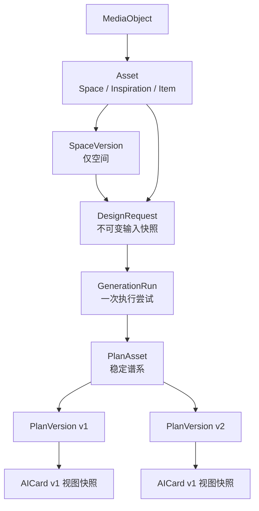

# 新产品蓝图 P0：后端接口与开发交接

> 更新日期：2026-07-25
> 读者：后端开发、前端联调、产品验收
> 文档状态：`0.3.0` 比赛 P0 实现基线；机器协议见 `platform-v1.schema.json`，当前工程事实见根目录 `HANDOFF.md`
> 重要说明：本文中的 `/api/v1/**` 已完成单进程 P0；RoomProfile 和首次主方案
> Seedream 效果图已接 Agent Plan。真实鉴权、商品/内容、候选与调整后重绘、限流
> 和生产队列仍不在已实现范围。
> 产品依据：产品同学 2026-07 新版《AI 一角焕新：产品蓝图与全链路功能清单》

对应前端任务见：
[抖音展示 Demo 前端交接](../apps/douyin-demo/HANDOFF.md)。

---

## 1. 结论与迁移原则

现有后端已经完成一个可验证的生成内核，但新版产品要求的是资产平台。
下一阶段必须在不破坏当前演示的前提下增加资源化 `/api/v1`：

- 保留 `GET /api/health`、`POST /api/generate` 和 `POST /api/revise`；
- 新前端业务使用 `/api/v1`，旧接口只作为兼容桥；
- `AICard v1` 继续作为前端结果 DTO，不作为数据库事实模型；
- 两条入口只创建一种不可变 `DesignRequest`；
- 空间、任务、生成尝试、方案谱系和方案版本必须有不同稳定身份；
- 商品价格、尺寸、库存、来源和规则校验只由后端拥有；
- 资产、任务和方案必须跨进程重启恢复；
- 私有媒体不得放在公开静态目录，删除必须清理原图和派生文件。

### 1.1 当前已实现

| 能力 | 状态 | 当前事实 |
| --- | --- | --- |
| `GET /api/health` | 已实现 | 健康、模式和内存卡片信息 |
| `POST /api/generate` | 已实现 | 同步 GenerateRequest → AICard |
| `POST /api/revise` | 已实现 | 同步降预算并创建请求级方案快照 |
| AICard v1 / 请求 Schema | 已实现 | 有固定 JSON 和正反例 |
| 确定性规则 | 已实现 | 预算、打孔、保留、尺寸、库存、宠物 |
| Demo/Live/Fallback | 已实现 | Live 只接 RoomProfile 网关 |
| AICard 保存 | 已实现 | PlanVersion + SQLite 持久快照，旧接口卡片同样持久 |
| 账号和所有权 | P0 已实现 | 服务端固定 Demo actor；仍不能安全暴露公网 |
| 资产 CRUD/版本 | 已实现 | 三类资产、解析状态、默认空间和 SpaceVersion |
| 持久任务和方案历史 | 已实现 | DesignRequest、Run、PlanAsset/Version 跨重启恢复 |
| 换风格调整 | 已实现 | `/api/v1` 支持 `change_style`；旧 revise 继续只降预算 |
| 隐私删除和事件 | P0 已实现 | binding/ref count、短时媒体、级联清理和白名单事件 |

当前自动验证：

```powershell
Set-Location 'C:\Users\xbhmd\Desktop\大区赛\ai-corner-renewal'
npm.cmd run check
npm.cmd run demo:backend
```

预期为 48 个测试通过，并输出 500 元生成和 300 元调整示例。
任何 `/api/v1` 开发都不能让这条兼容验证回归。

### 1.2 目标成熟度

本阶段已达到“比赛 P0 可持久联调版”，不是生产级平台：

- 1 个服务端固定 Demo 用户；
- SQLite 或等价轻量持久化；
- 本地私有媒体目录和短时访问地址；
- 进程内生成队列 + 前端轮询；
- 受控 Demo 商品、教程和视频上下文；
- 1 次授权的真实空间理解，其余可诚实降级；
- 不要求真实抖音账号、交易、库存或外部消息队列。

---

## 2. 对象模型与身份



### 2.1 ID 必须冻结

| 字段 | 语义 | 可变性 |
| --- | --- | --- |
| `media_id` | 一份私有原始或派生媒体 | 稳定，删除后失效 |
| `asset_id` | 空间、灵感或单品的稳定身份 | 稳定 |
| `resource_version` | Asset、PlanAsset、Preference 等可变元数据的乐观锁版本 | 每次 PATCH 递增 |
| `space_version_id` | 一组空间图片和解析快照 | draft 可确认；sealed 后不可变 |
| `parse_run_id` | 一次资产解析尝试 | 不可变 |
| `design_request_id` | 一次已冻结的设计输入 | 不可变 |
| `generation_run_id` | 一次工作流执行或重试 | 不可变 |
| `plan_asset_id` | 一组方案版本的稳定谱系 | 稳定 |
| `plan_version_id` | 一次生成或调整结果快照 | 不可变 |
| `parent_plan_version_id` | 当前版本从哪个版本调整而来 | 不可变 |
| `version` | 同一 PlanAsset 内单调递增序号 | 不可变 |
| HTTP `request_id` | 日志和错误关联 | 不是业务对象身份 |

当前 AICard 中的 `plan.plan_id` 已经是请求级快照 ID。迁移时让它等于
`plan_version_id`，不要把它改成稳定的 `plan_asset_id`。

新接口固定：

- `AICard.request_id = generation_run_id`；
- `AICard.room_profile.room_id = space_version_id`；
- `AICard.plan.room_id = space_version_id`；
- `AICard.plan.plan_id = plan_version_id`；
- alternative 的 plan ID 仅是当前版本内 candidate ID。

HTTP `request_id` 始终是另一种日志关联 ID。新接口的持久导航仍优先使用外层
PlanVersionEnvelope，不从 AICard 字符串反推资源类型。

### 2.2 容易混淆的对象

- `detected_object_id`：空间解析出的物体；
- `item_asset_id`：用户主动保存的单品资产；
- `product_id`：受控商品目录候选；
- `editHistory`：仅前端即时撤销；
- `PlanVersion`：服务端持久方案历史；
- `source_mode`：计算来源 `demo | live | fallback`；
- `provenance.kind`：素材来源 `upload | video_context | demo_seed | plan_result`。

### 2.3 状态枚举

资产保存和资产解析是两个维度：

```text
asset_type:
space | inspiration | item

asset.lifecycle:
temporary | saved | archived

asset.parse_state:
queued | parsing | needs_confirmation | ready | failed

space_version.state:
draft | sealed
```

其他状态：

```text
space.detected_object.disposition:
keep | movable | removable

item.user_role:
owned | wanted | reference

item.identity_level:
category_only | candidate | confirmed

design_request.validation_state:
valid | needs_input

generation_run.status:
queued | running | succeeded | failed | cancelled

generation_run.source_mode:
null | demo | live | fallback

generation_run.phase:
input_validation | space_analysis | reference_analysis |
constraint_filter | matching | planning | rendering |
validation | packaging

plan.lifecycle:
draft | saved | archived

plan.decision_state:
undecided | selected | executing | completed

revision.action.type:
reduce_budget | change_style
```

保留现有：

- `AICard.status`：`ready | fallback_ready | needs_input`
- `ValidationReport.overall_status`：
  `pass | needs_confirmation | failed | blocked`
- `source_mode`：`demo | live | fallback`

`source_mode` 只概括本次空间理解/编排的主要来源：

- `live` 不表示商品、教程、效果图或视频都是真实在线数据；效果图必须另外读取
  `render.is_demo_asset` 和 `data_sources[kind=render_generation]`；
- 每个输出成分仍以 AICard `data_sources[]` 为准；
- 输入素材来源以 Asset `provenance` 为准；
- 前端来源文案必须说“空间理解：Live/Demo/Fallback”，不能只显示一个笼统
  “全链路 Live”徽标。

删除是终态操作，用 `deleted_at` 和不可访问语义表示，不新增一个仍可匹配的
`lifecycle=deleted`。

---

## 3. 模块和规则所有权

| 模块 | 负责 | 不负责 |
| --- | --- | --- |
| `SourceIngestionService` | 上传签名校验、去 EXIF/GPS、视频上下文、素材去重 | 生成方案 |
| `PermissionService` | actor 注入、所有权、私有访问、删除授权 | 解析和匹配 |
| `AssetService` | 资产 CRUD、默认空间、最近使用、空间版本、归档和删除编排 | 模型调用 |
| `AssetParseService` | 空间/灵感/单品解析、状态、失败原因、用户确认 | 持久方案版本 |
| `MatchingService` | 硬约束过滤、兼容资产排序、可解释理由 | 用户侧伪精确分 |
| `DesignRequestService` | 校验统一请求、读取所有权、冻结输入快照 | 执行生成 |
| `PlanService` | GenerationRun、现有 Workflow、结果、方案谱系、调整 | 媒体权限 |
| `PreferenceService` | P0 显式偏好和简单行为计数 | 自动强偏好推断 |
| `EventService` | 白名单漏斗事件和最小化存储 | 原图或自由文本分析 |
| `ProviderAdapters` | RoomProfile/图像/内容供应方转换和降级 | 将供应商响应透传前端 |
| `packages/validation` | 预算、打孔、保留、尺寸、库存和安全纯规则 | HTTP 和数据库 |
| `packages/contracts` | JSON Schema、枚举、错误码和兼容策略 | 页面状态 |

现有 `services/orchestrator/src/workflow.js` 应成为 `PlanService` 的生成内核，
不再创建第二套视频工作流或空间工作流。

---

## 4. API 总览与实现状态

### 4.1 兼容接口

| 方法与路径 | 状态 | 迁移策略 |
| --- | --- | --- |
| `GET /api/health` | 已实现，继续保留 | 增加持久化版本、鉴权模式和上传限制 |
| `GET /api/openapi.json` | 已实现 | 返回与共享路由清单、Schema 同源生成的 OpenAPI 3.1 |
| `POST /api/generate` | 已实现，继续保留 | 内部适配到临时资产、DesignRequest 和 GenerationRun |
| `POST /api/revise` | 已实现，继续保留 | 内部适配为 `reduce_budget` PlanRevision |

比赛前不删除、不改破坏性字段。新前端正式业务只调用 `/api/v1`。

### 4.2 `/api/v1` P0 接口

| 分组 | 方法与路径 | 状态 | 最小职责 |
| --- | --- | --- | --- |
| 媒体 | `POST /api/v1/media` | 已实现 | 上传、校验、去元数据、返回媒体 ID |
| 媒体 | `GET /api/v1/media/{media_id}/content?token=...` | 已实现 | 校验短时签名后返回私有媒体字节 |
| 媒体 | `DELETE /api/v1/media/{media_id}` | 已实现 | 删除未关联媒体或取消上传 |
| 资产 | `POST /api/v1/assets` | 已实现 | 创建空间/灵感/单品并排队解析 |
| 资产 | `GET /api/v1/assets` | 已实现 | 列表、筛选、最近排序和兼容匹配 |
| 资产 | `GET /api/v1/assets/{asset_id}` | 已实现 | 详情、解析状态、来源和关联方案 |
| 资产 | `PATCH /api/v1/assets/{asset_id}` | 已实现 | 重命名、标签、确认、保存、默认、归档 |
| 资产 | `DELETE /api/v1/assets/{asset_id}` | 已实现 | 所有权校验和级联清理 |
| 资产 | `POST /api/v1/assets/{asset_id}/parse-runs` | 已实现 | 解析失败重试 |
| 空间版本 | `POST /api/v1/assets/{space_asset_id}/versions` | 已实现 | 新照片创建不可变 SpaceVersion |
| 空间版本 | `PATCH /api/v1/assets/{space_asset_id}/versions/{space_version_id}` | 已实现 | 仅确认 draft，并封存为 sealed |
| 空间版本 | `GET /api/v1/assets/{space_asset_id}/versions` | 已实现 | 空间版本摘要 |
| 设计任务 | `POST /api/v1/design-requests` | 已实现 | 创建不可变任务和输入快照 |
| 设计任务 | `GET /api/v1/design-requests/{id}` | 已实现 | 读取快照、校验和运行记录 |
| 生成 | `POST /api/v1/design-requests/{id}/runs` | 已实现 | 开始或重试生成 |
| 生成 | `GET /api/v1/generation-runs/{id}` | 已实现 | 轮询阶段和结果 |
| 生成 | `POST /api/v1/generation-runs/{id}/cancel` | 已实现 | 取消未完成运行 |
| 方案 | `GET /api/v1/plans` | 已实现 | 持久方案历史和筛选 |
| 方案 | `GET /api/v1/plans/{plan_asset_id}` | 已实现 | 谱系和版本摘要 |
| 方案 | `GET /api/v1/plans/{plan_asset_id}/versions/{plan_version_id}` | 已实现 | 完整方案版本和 AICard |
| 方案 | `POST /api/v1/plans/{plan_asset_id}/revisions` | 已实现 | 降预算/换风格并创建新版本 |
| 方案 | `PATCH /api/v1/plans/{plan_asset_id}` | 已实现 | 生命周期和用户决策状态 |
| 偏好 | `GET /api/v1/me/preferences` | 已实现 | 当前显式偏好 |
| 偏好 | `PATCH /api/v1/me/preferences` | 已实现 | 更新/暂停/重置显式偏好 |
| 事件 | `POST /api/v1/events/batch` | 已实现 | 白名单事件批量写入 |

P0 不新增分享、搜索、资产合并、多人家庭、通知、支付、真实交易、单品替换和
多方案并发编辑接口。

---

## 5. 通用 HTTP 契约

### 5.1 身份

比赛 P0：

- 服务端固定注入 `actor_id=demo-user-001`；
- Controller、Service、Repository 每层都显式传 `actor_id`；
- 客户端 Body 中出现 `owner_id` 应返回 422；
- 跨用户资源统一返回 404，避免枚举私有资产；
- 公网部署前必须替换为真实鉴权，不接受客户端自报用户 ID。

### 5.2 浏览器 CORS

当前旧服务只覆盖 GET/POST 和少量 Header，不能直接承载新版浏览器联调。
`/api/v1` 必须：

- 允许方法：`GET, POST, PATCH, DELETE, OPTIONS`；
- 允许请求头：`Content-Type, Idempotency-Key`，真实鉴权后再加入 `Authorization`；
- 暴露响应头：`X-Request-Id, ETag, Deprecation, Sunset`；
- 对配置中的确切前端 Origin 返回 `Access-Control-Allow-Origin`，不使用带凭据的 `*`；
- OPTIONS 不进入业务和模型调用；
- 私有媒体 content 响应同样允许受控前端 Origin；
- 为 JSON、Multipart、PATCH、DELETE、Idempotency-Key 和媒体 Canvas 读取增加预检测试。

前端在 8765、API 在 8787 是不同 Origin。媒体短时相对 URL 由前端以 API base
解析；若要绘入 Canvas，媒体响应必须满足 CORS，否则浏览器会污染 Canvas。

### 5.3 幂等

以下接口要求 `Idempotency-Key`：

- 创建媒体、资产、DesignRequest；
- 创建资产解析任务和 SpaceVersion；
- 创建 GenerationRun；
- 创建 PlanRevision；
- 事件批次。

幂等作用域固定为：

```text
actor_id + HTTP method + canonical route template + Idempotency-Key
```

canonical route 使用 `/api/v1/assets/{asset_id}` 这类模板，不把 query 顺序或真实
实体 ID 混成作用域。请求 fingerprint 必须另行包含：

- 解析后的真实 path params；
- 排序后的受支持 query；
- 规范化 JSON 或 Multipart 文本字段；
- 每个上传文件的字节 digest、大小和媒体类型。

因此同一个 Key 不能把 `/assets/A/...` 的响应误重放给 `/assets/B/...`。
相同作用域、Key 和相同 fingerprint，重放第一次的
HTTP status、响应 Body 和必要响应 Header；请求哈希不同返回 409
`idempotency_key_reused`。幂等记录必须持久化，不能只放进程内 Map。

客户端与服务端共同约定：

- 网络超时或自动重发同一次操作时复用原 Key；
- 用户修改输入、明确创建新资源或失败后发起新一次业务重试时使用新 Key；
- 服务端不能建议客户端通过换 Key 绕过仍在执行的并发保护；
- Key 只代表一次用户意图，不是 asset/run/plan 的长期业务 ID。

### 5.4 乐观锁

Asset、draft SpaceVersion、PlanAsset 和 Preference PATCH 携带当前
`resource_version`：

```json
{
  "schema_version": "1.0",
  "resource_version": 3,
  "changes": {}
}
```

版本不匹配返回 409 `resource_version_conflict`，响应带当前版本摘要。

### 5.5 成功状态

| 操作 | HTTP | 响应 |
| --- | --- | --- |
| 所有 GET | 200 | 资源或分页列表 |
| 上传媒体 | 201 | MediaObject |
| 删除未关联媒体 | 204 | 无 Body |
| 新建资产 | 201 | Asset |
| 资产去重复用 | 200 | Asset + `deduplicated=true` |
| PATCH Asset/SpaceVersion/Plan/Preference | 200 | 更新后的资源和新 `resource_version` |
| DELETE Asset | 204 | 无 Body；表示隐私清理已达到本节保证 |
| 创建解析 run | 202 | ParseRun |
| 创建 SpaceVersion | 201 | draft SpaceVersion |
| 创建 DesignRequest | 201 | DesignRequest |
| 创建 GenerationRun | 202 | GenerationRun |
| 取消 GenerationRun | 200 | `status=cancelled` 的 GenerationRun |
| 创建 PlanRevision | 202 | 派生 DesignRequest + GenerationRun 摘要 |
| 写入事件批次 | 202 | batch ID、accepted/rejected 数量 |

### 5.6 错误外壳

继续沿用当前结构化错误方向：

```json
{
  "schema_version": "1.0",
  "request_id": "http-request-01",
  "error": {
    "code": "design_request_invalid",
    "message": "设计任务缺少可用目标或参考资产",
    "retryable": false,
    "issues": [
      {
        "path": "/goal",
        "code": "goal_or_reference_required",
        "message": "请填写目标或选择至少一个参考资产"
      }
    ],
    "details": {}
  }
}
```

| HTTP | 用途 |
| --- | --- |
| 400 | JSON/Multipart 无法解析 |
| 403 | 浏览器 Origin 或资源访问被拒绝 |
| 404 | 资源不存在或当前 actor 无权访问 |
| 405 | 路径存在但方法不支持；响应同时返回 `Allow` Header 和 `allowed_methods` |
| 409 | 幂等冲突、资源版本冲突、非法状态转换 |
| 413 | 文件或请求体过大 |
| 415 | 不支持的媒体类型 |
| 422 | 结构合法但字段/业务规则不满足 |
| 429 | 生产限流预留；当前单进程 P0 尚未启用 |
| 500 | 未知内部错误，响应不含堆栈 |
| 502/504 | 已选择不降级时的供应方失败/超时 |

模型失败且成功使用受控 Demo 降级时返回业务成功，结果中使用
`source_mode=fallback`，不能同时返回 500。

---

## 6. 媒体接口

### 6.1 上传

`POST /api/v1/media`

`multipart/form-data`：

| 字段 | 必需 | 示例 |
| --- | --- | --- |
| `file` | 是 | JPEG / PNG / WebP |
| `purpose` | 是 | `space_source` / `reference_source` |
| `retention` | 否 | P0 只接受 `temporary`，省略时同样为 temporary |

成功返回 201：

```json
{
  "schema_version": "1.0",
  "media_id": "media-001",
  "media_type": "image/jpeg",
  "width_px": 1440,
  "height_px": 1080,
  "byte_size": 823144,
  "sanitized": true,
  "retention_expires_at": "2026-07-26T12:00:00.000Z",
  "access": {
    "url": "/api/v1/media/media-001/content?token=short-lived-token",
    "expires_at": "2026-07-25T12:15:00.000Z"
  },
  "created_at": "2026-07-25T12:00:00.000Z"
}
```

服务端必须：

- 验证 MIME、扩展名和真实文件签名；
- 只允许 JPEG、PNG、WebP；
- 去除 EXIF/GPS 后再存储；
- 原始字节和访问 Token 不进入日志；
- 存储在静态 Web 根目录之外；
- 返回的 URL 短时有效，数据库只保存 storage key；
- 未绑定媒体默认按 `TEMPORARY_RETENTION_HOURS=24` 清理；
- 创建资产成功后由服务端原子绑定媒体：saved 资产取消临时过期，temporary 资产
  继承同一临时期限；客户端不能自报 `asset_bound`；
- 上传限制由 `GET /api/health` 的 `limits` 返回，前端不再写死 20MB。

### 6.2 读取私有媒体

`GET /api/v1/media/{media_id}/content?token=...`

- 该地址只由服务端生成，不是客户端自行拼接的稳定 URL；
- Token 绑定 `media_id`、actor/分享语境、用途和过期时间；
- 过期、篡改、已删除或作用域不匹配统一返回 404；
- 响应禁止公共缓存，并使用正确的 `Content-Type`、长度和下载策略；
- 访问日志不得记录 query token；结构化日志只记录脱敏 media ID 和结果码；
- 列表、详情和方案接口可随时签发新 URL，客户端不能持久保存旧 URL。

### 6.3 删除未关联媒体

`DELETE /api/v1/media/{media_id}`

- 用户取消上传且媒体尚未关联资产时返回 204；
- Asset 与 Media 使用显式多对多 binding/ref count，不能假定一个媒体只属于一个资产；
- 已经被任一有效资产引用时返回 409，要求通过资产删除流程处理；
- 媒体上传后即使资产创建失败，也会在 `retention_expires_at` 清理；
- 临时资产到期时级联清理所绑定媒体；
- 默认 24 小时是服务端配置，响应返回确切时间，前端不得自行推算。

---

## 7. 资产接口

### 7.1 创建资产

`POST /api/v1/assets`

空间上传示例：

```json
{
  "schema_version": "1.0",
  "asset_type": "space",
  "lifecycle": "temporary",
  "media_ids": [
    "media-001"
  ],
  "provenance": {
    "kind": "upload"
  },
  "attributes": {
    "name": "未命名书桌",
    "scene_type": "desk_corner",
    "reference_width_cm": 120,
    "default_budget_cny": 500,
    "long_term_constraints": [
      "no_drilling"
    ]
  }
}
```

视频参考示例：

```json
{
  "schema_version": "1.0",
  "asset_type": "inspiration",
  "lifecycle": "temporary",
  "media_ids": [
    "media-keyframe-001"
  ],
  "provenance": {
    "kind": "video_context",
    "provider": "douyin_demo",
    "external_content_id": "video-2",
    "author_display": "@白了少年头",
    "timestamp_ms": 3200,
    "selection_bbox": {
      "x": 0.12,
      "y": 0.18,
      "width": 0.46,
      "height": 0.38
    }
  },
  "attributes": {
    "name": "原木暖光桌搭",
    "inspiration_scope": "overall",
    "user_note": "我喜欢暖光和收纳关系"
  }
}
```

响应 201：

```json
{
  "schema_version": "1.0",
  "asset_id": "space-001",
  "asset_type": "space",
  "lifecycle": "temporary",
  "parse_state": "queued",
  "name": "未命名书桌",
  "tags": [],
  "is_default": false,
  "resource_version": 1,
  "current_space_version_id": "space-version-001",
  "expires_at": "2026-07-26T12:00:00.000Z",
  "created_at": "2026-07-25T12:00:00.000Z",
  "updated_at": "2026-07-25T12:00:00.000Z"
}
```

同一用户重复收藏同一视频、时间点和近似圈选区域时：

- 返回 200；
- 返回已有资产；
- 增加 `deduplicated=true`；
- 不创建重复解析任务。

视频动作与生命周期：

- “收藏为灵感/收藏单品”直接创建或升级为 `lifecycle=saved`；
- “放进我家”但未主动收藏时创建 `lifecycle=temporary`；
- 去重键至少包含 actor、`asset_type`、provider、内容 ID、时间点分桶和规范化圈选；
- 同一圈选可以分别成为 inspiration 和 item，不能跨 `asset_type` 去重；
- 已有 temporary 再被用户收藏时原子升级为 saved，不创建第二份资产；
- 已有 saved 再次“放进我家”直接复用 saved 资产，不降级为 temporary；
- temporary 响应返回 `expires_at`，升级 saved 后该字段为 `null`。

客户端不提交 `parse_state`、`owner_id`、系统标签或模型置信度。

### 7.2 列表和匹配

`GET /api/v1/assets`

查询参数：

| 参数 | 示例 | 说明 |
| --- | --- | --- |
| `asset_type` | `space` | `space/inspiration/item` |
| `lifecycle` | `saved` | 默认不返回 archived |
| `parse_state` | `ready` | 可选 |
| `sort` | `recent` / `match` | 最近使用或兼容匹配 |
| `compatible_with_asset_id` | `inspiration-001` | 返回兼容资产和理由 |
| `cursor` | opaque | 不解析的分页游标 |
| `limit` | `20` | 服务端限制上限 |

视频进入空间选择：

```text
GET /api/v1/assets
  ?asset_type=space
  &sort=match
  &compatible_with_asset_id=inspiration-001
  &limit=3
```

匹配结果额外包含：

```json
{
  "match_reasons": [
    "同为书桌场景",
    "这是你的默认空间",
    "不需要打孔"
  ]
}
```

用户侧不返回看似精确的“适配度 86%”。内部排序分可以保存到 Trace。

### 7.3 详情

`GET /api/v1/assets/{asset_id}`

空间解析详情最小示例：

```json
{
  "schema_version": "1.0",
  "asset_id": "space-001",
  "asset_type": "space",
  "lifecycle": "temporary",
  "parse_state": "needs_confirmation",
  "name": "未命名书桌",
  "resource_version": 2,
  "current_space_version_id": "space-version-001",
  "current_space_version": {
    "space_version_id": "space-version-001",
    "state": "draft",
    "resource_version": 2,
    "parse_state": "needs_confirmation"
  },
  "preview": {
    "url": "/api/v1/media/media-001/content?token=short-lived-token",
    "expires_at": "2026-07-25T12:15:00.000Z"
  },
  "attributes": {
    "scene_type": "desk_corner",
    "reference_width_cm": 120,
    "editable_regions": [
      {
        "editable_region_id": "desktop-and-back-wall",
        "label": "桌面与后墙"
      }
    ],
    "detected_objects": [
      {
        "detected_object_id": "detected-monitor",
        "category": "monitor",
        "display_name": "显示器",
        "bbox": {
          "x": 0.31,
          "y": 0.18,
          "width": 0.28,
          "height": 0.31
        },
        "detection_confidence": 0.94,
        "disposition": "keep",
        "confirmation_state": "suggested"
      }
    ],
    "uncertainties": [
      {
        "code": "desk_depth_unknown",
        "message": "桌面深度未知，购买前需要复测"
      }
    ]
  },
  "related_plan_count": 0,
  "created_at": "2026-07-25T12:00:00.000Z",
  "updated_at": "2026-07-25T12:00:04.000Z"
}
```

bbox 统一使用 0～1 的 `{x,y,width,height}`。后端验证范围；前端负责适配 Canvas。
空间 Asset 顶层 `parse_state` 是当前 SpaceVersion 的便捷投影；历史版本的状态从
versions 列表读取。确认 draft 时必须使用
`current_space_version.resource_version`，不能误用 Asset 的 `resource_version`。

### 7.4 修改资产

`PATCH /api/v1/assets/{asset_id}`

```json
{
  "schema_version": "1.0",
  "resource_version": 2,
  "changes": {
    "name": "我的卧室书桌",
    "lifecycle": "saved",
    "is_default": true,
    "tags": [
      "书桌",
      "暖色"
    ],
    "attributes": {
      "default_budget_cny": 500,
      "long_term_constraints": [
        "no_drilling"
      ]
    }
  }
}
```

规则：

- `changes` 只允许类型白名单字段；
- 数组字段整体替换，未出现字段保持不变；
- 默认空间必须是 `saved + space`；
- 设为默认时事务内取消旧默认空间；
- 空间事实、参考尺寸、编辑区和检测物确认不通过 Asset PATCH 修改；
- 用户修正标签只影响后续任务，不改历史快照；
- `resource_version` 不一致返回 409。

### 7.5 解析重试

`POST /api/v1/assets/{asset_id}/parse-runs`

```json
{
  "schema_version": "1.0",
  "reason": "user_retry",
  "space_version_id": "space-version-001"
}
```

返回 202：

```json
{
  "parse_run_id": "parse-run-002",
  "asset_id": "space-001",
  "space_version_id": "space-version-001",
  "status": "queued",
  "retry_of": "parse-run-001"
}
```

空间资产有多个版本时 `space_version_id` 必需，且只能重试该资产的 draft 版本；
inspiration/item 不传该字段。前端继续轮询资产详情。解析失败不得删除原素材。

解析并发规则：

- 同一 asset target（空间为具体 SpaceVersion，其他为 Asset）最多一个 queued/running parse；
- 已有 active parse 时返回 409 `asset_parse_already_active` 和 active parse run ID；
- 只有 failed 才能以 `reason=user_retry` 重试；
- ready 或 sealed target 再解析返回 409 `asset_parse_not_retryable`；
- 相同 Idempotency-Key 的连点按通用幂等规则重放第一次 202。

### 7.6 空间版本

`POST /api/v1/assets/{space_asset_id}/versions`

```json
{
  "schema_version": "1.0",
  "parent_space_version_id": "space-version-001",
  "media_ids": [
    "media-002"
  ],
  "reference_width_cm": 118
}
```

返回新的 `space_version_id`、`state=draft` 并进入 `queued`。首次创建 SpaceAsset
时也自动创建一个 draft SpaceVersion。

解析完成并经用户确认：

`PATCH /api/v1/assets/{space_asset_id}/versions/{space_version_id}`

```json
{
  "schema_version": "1.0",
  "resource_version": 2,
  "changes": {
    "reference_width_cm": 118,
    "editable_region_id": "desktop-and-back-wall",
    "detected_object_confirmations": [
      {
        "detected_object_id": "detected-monitor",
        "disposition": "keep"
      }
    ],
    "seal": true
  }
}
```

封存规则：

- 只有 `draft` 可 PATCH；
- draft 使用自己的 `resource_version` 防止并发覆盖；
- 只能从 `parse_state=needs_confirmation` 或 `ready` 封存；
- queued、parsing 或 failed 封存返回 409 `space_version_not_confirmable`；
- `seal=true` 前必须有可访问媒体、场景类型、至少一个可编辑区，且所有提交的
  detected object ID 都属于该版本；
- blocking 确认项未完成返回 422，并通过 `issues[]` 指向缺失字段；
- `seal=true` 后状态变为 `sealed`，事实、媒体、确认和分析快照全部不可变；
- 封存成功后该版本及 Asset 便捷投影的 `parse_state=ready`；
- DesignRequest 只能引用 sealed SpaceVersion；
- sealed 后要改参考尺寸、检测物或图片，必须 POST 一个从父版本克隆的新版本；
- Asset 上的名称、默认空间、默认预算和长期约束仍可独立 PATCH，并由任务创建时快照。

`GET /api/v1/assets/{space_asset_id}/versions` 返回版本摘要、时间、封面和关联方案数。
历史方案始终保留原 `space_version_id`。

### 7.7 删除

`DELETE /api/v1/assets/{asset_id}`

执行顺序：

1. 校验所有权；
2. 标记资产 tombstone，立即停止列表、匹配和生成引用；
3. 移除该资产的媒体 binding；只物理删除 ref count 归零的原图；
4. 删除该资产独占的缩略图、分析派生图、缓存和索引；
5. 历史方案保留脱敏快照，但不再返回已删除原图；
6. 记录不含媒体和用户文本的删除审计。

成功返回 204，表示：

- 资产已逻辑不可访问；
- 所有独占媒体和派生文件已完成物理删除；
- 共享媒体只因其他仍有效资产而保留，已删除资产不能再获得其访问 URL。

任一物理清理失败时不返回 204：保持访问撤销，记录 `deletion_pending` 并返回 500
`asset_deletion_incomplete`，后台与用户重试使用同一幂等删除流程。重复删除在清理
完成后返回 204。

删除后的历史读取与重跑：

- PlanVersion 数据快照保持不可变，媒体字段持久保存逻辑 `media_id`，不保存签名 URL；
- API 序列化层按当前权限生成可访问投影；
- 来源资产已删除时，响应中的 `render.before_ref` 使用
  `asset://redacted/source-deleted` 占位；
- 若派生效果图也被清理，则同时把 `plan.render_ref` 和 `render.after_ref` 投影为
  `asset://redacted/render-deleted`，保持 AICard v1 的二者相等约束；
- PlanVersion 响应增加 `redactions`，说明哪些媒体因删除不可见；
- 商品、步骤、预算和校验等非媒体快照仍可查看；
- 引用了已删除资产的旧 DesignRequest 不能再次创建 run，返回 409
  `design_request_source_unavailable`；
- 用户可以从保留的非敏感信息创建一个新的 DesignRequest，但必须重新选择有效空间。

---

## 8. 统一 DesignRequest

### 8.1 创建

`POST /api/v1/design-requests`

```json
{
  "schema_version": "1.0",
  "trigger": "video_apply",
  "space_asset_id": "space-001",
  "space_version_id": "space-version-002",
  "reference_asset_ids": [
    "inspiration-001",
    "item-001"
  ],
  "goal": "更整洁，并增加暖光",
  "goal_codes": [
    "organization",
    "ambient_lighting"
  ],
  "constraints": {
    "budget_cny": 500,
    "no_drilling": true,
    "keep_detected_object_ids": [
      "detected-desk",
      "detected-chair",
      "detected-monitor"
    ],
    "pet_context": "none"
  },
  "editable_region_id": "desktop-and-back-wall",
  "options": {
    "analysis_mode": "auto",
    "include_trace": true
  }
}
```

P0 `trigger`：

```text
video_apply | space_upload | space_reuse | asset_detail | plan_continue
```

字段冻结规则：

| 字段 | 规则 |
| --- | --- |
| `trigger` | 必需；客户端可用前四种，`plan_continue` 只由 revision 服务创建 |
| `space_asset_id` | 必需、非空字符串 |
| `space_version_id` | 必需，必须是该空间的 sealed 版本 |
| `reference_asset_ids` | 必需数组，0～3 个唯一 ID |
| `goal` | 可选；若出现必须是 trim 后 1～500 字符的字符串，不接受 null |
| `goal_codes` | 必需数组，0～5 个唯一受控枚举 |
| `constraints` | 必需对象；子字段可省略，由服务端按明确优先级解析 |
| `constraints.budget_cny` | 可选整数，1～1,000,000；不接受字符串或 null |
| `constraints.no_drilling` | 可选布尔值，不接受 `"true"` |
| `constraints.keep_detected_object_ids` | 可选唯一字符串数组，最多 64 个 |
| `constraints.pet_context` | 可选 `none | cat | dog | other` |
| `editable_region_id` | 可选非空字符串；多个可编辑区时缺失会阻断 |
| `options.analysis_mode` | 可选 `auto | demo | live`，默认 `auto` |
| `options.include_trace` | 可选布尔值，默认 false；评委模式可传 true |

P0 `goal_codes`：

```text
organization | ambient_lighting | study_focus |
low_budget | reuse_existing
```

可选字段一律“省略表示未提供”，不使用 null。持久 `input_snapshot` 则必须保存
解析后的预算、打孔、保留物、宠物、编辑区及各自来源：
`request | space_default | preference | system_default`。

校验规则：

- 恰好一个空间资产和空间版本；
- SpaceVersion 必须属于该 SpaceAsset；
- 参考资产 0～3 个，只能是灵感或单品；
- `goal`、`goal_codes` 或参考资产至少一项非空；
- 所有资产属于当前 actor，未归档、未删除；
- 解析未完成时返回结构化 `needs_input`；
- 保留物和编辑区必须来自选定 SpaceVersion；
- 未传编辑区且 sealed SpaceVersion 只有一个可编辑区时可自动选择；有多个时返回
  `can_start_generation=false`；
- 预算、打孔、宠物等同时写入不可变输入快照；
- 创建后不能 PATCH；用户改输入必须创建新 DesignRequest。

例如另一个未传预算、但可使用偏好默认预算的请求仍返回 201：

```json
{
  "schema_version": "1.0",
  "design_request_id": "design-request-001",
  "validation_state": "needs_input",
  "can_start_generation": true,
  "missing_fields": [
    {
      "path": "/constraints/budget_cny",
      "code": "budget_recommended",
      "message": "填写预算后可以生成可执行商品组合",
      "blocking": false
    }
  ],
  "input_snapshot_summary": {
    "space_asset_id": "space-001",
    "space_version_id": "space-version-002",
    "reference_asset_ids": [
      "inspiration-001",
      "item-001"
    ],
    "resolved_budget_cny": 500,
    "budget_source": "preference"
  },
  "created_at": "2026-07-25T12:05:00.000Z"
}
```

`can_start_generation=false` 时不能创建 GenerationRun；非阻断不确定项使用
`can_start_generation=true`，生成后可进入 `AICard.status=needs_input` 或校验警告。
创建响应只返回 `input_snapshot_summary`；`GET /api/v1/design-requests/{id}` 和
PlanVersionEnvelope 返回完整不可变快照。

阻断字段补齐时，客户端修改本地草稿并重新
`POST /api/v1/design-requests`，获得新的 `design_request_id`；旧请求不 PATCH，
只保留审计，也不能用旧 ID 创建 run。

现有 AICard v1 只有一个 `InspirationProfile`，而新请求允许 0～3 个参考资产。
PlanService 应把“参考资产 + 目标 + 显式偏好”组合成一个派生的聚合
`InspirationProfile`：

- `inspiration_id` 固定为
  `aggregate-inspiration-{design_request_id}`，只作为结果内派生身份；
- 没有参考资产时使用 `source_type=user_goal`，不能伪造一条灵感资产；
- 有多个参考资产时使用 `source_type=aggregated_references`；
- 原始引用关系只以 DesignRequest 输入快照为事实来源；
- AICard 中的聚合 Profile 仅用于结果展示和兼容，不反向写成用户资产。

同理，现有 AICard v1 的 `constraints.hard_constraints` 只有少量 Demo 枚举，
不能承载任意 `keep_detected_object_ids`。完整动态约束以 DesignRequest/PlanVersion
外层快照和 ValidationReport 为准：

- 不把检测物 ID 塞进 `keep_desk/keep_chair` 等旧枚举；
- 兼容 AICard 只保留能够无损映射的旧摘要；
- PlanVersion 详情必须同时返回 `design_request_snapshot`；
- 前端从快照展示具体保留物，从 ValidationReport 展示是否满足；
- 若未来要求单个 DTO 自包含全部动态约束，应发布 AICard v2。

为满足现有 AICard v1 的必填 `constraints.goals` 和 `budget_cny`，P0 固定转换：

1. goals 优先使用显式 `goal_codes`；
2. 只有自由文本时写入受控代码 `custom_goal`，原文只留 DesignRequest 快照；
3. 只有参考资产时写入 `reference_guided_design`，并增加
   `goal_derived_from_reference` notice；
4. 预算优先级为：本次请求 → SpaceAsset 默认预算 → Preference 默认预算 →
   服务端 P0 默认 500 元；
5. 使用非本次请求预算时增加 `budget_defaulted` notice，并在
   `design_request_snapshot.budget_source` 标明来源；
6. 不允许模型自行生成另一个预算数字。

### 8.2 输入快照

必须保存：

- 空间和参考资产的 ID、类型、`resource_version`；
- 完整 SpaceVersion 事实；
- 参考资产当时的解析结果；
- 目标和约束；
- 显式偏好快照；
- 数据来源和授权语义；
- 创建时间与 actor。

资产之后改名、改标签或删除，不能重写历史 DesignRequest。

---

## 9. GenerationRun

### 9.1 开始或重试

`POST /api/v1/design-requests/{id}/runs`

```json
{
  "schema_version": "1.0",
  "reason": "initial"
}
```

失败重试仍调用同一路径，使用新 `Idempotency-Key` 和：

```json
{
  "schema_version": "1.0",
  "reason": "retry",
  "retry_of_generation_run_id": "generation-run-001"
}
```

返回 202：

```json
{
  "generation_run_id": "generation-run-002",
  "design_request_id": "design-request-001",
  "status": "queued",
  "phase": "input_validation",
  "source_mode": null,
  "retryable": false,
  "created_at": "2026-07-25T12:06:00.000Z"
}
```

并发规则：

- 同一 DesignRequest 同时最多一个 queued/running run；
- 不同 Idempotency-Key 在已有 active run 时返回 409
  `generation_run_already_active`，并带 active run ID；
- failed/cancelled 后可以创建 retry run；
- 已经 succeeded 的同一 DesignRequest 不重复运行，返回 409
  `design_request_already_succeeded`；
- 修改目标或约束必须创建新的 DesignRequest，方案调整走 revision 派生请求。

### 9.2 轮询

`GET /api/v1/generation-runs/{id}`

运行中：

```json
{
  "generation_run_id": "generation-run-002",
  "design_request_id": "design-request-001",
  "status": "running",
  "phase": "planning",
  "phase_index": 6,
  "phase_total": 9,
  "progress": 67,
  "source_mode": "live",
  "retryable": false,
  "needs_input": null,
  "result": null,
  "error": null,
  "updated_at": "2026-07-25T12:06:08.000Z"
}
```

成功：

```json
{
  "generation_run_id": "generation-run-002",
  "design_request_id": "design-request-001",
  "status": "succeeded",
  "phase": "packaging",
  "progress": 100,
  "source_mode": "live",
  "needs_input": null,
  "result": {
    "plan_asset_id": "plan-001",
    "plan_resource_version": 1,
    "plan_version": {
      "plan_version_id": "plan-version-001",
      "version": 1,
      "parent_plan_version_id": null,
      "design_request_id": "design-request-001",
      "design_request_snapshot": {
        "trigger": "video_apply",
        "space_asset_id": "space-001",
        "space_version_id": "space-version-002",
        "reference_asset_ids": [
          "inspiration-001"
        ],
        "goal": "更整洁，并增加暖光",
        "goal_codes": [
          "organization",
          "ambient_lighting"
        ],
        "constraints": {
          "budget_cny": 500,
          "no_drilling": true,
          "keep_detected_object_ids": [
            "detected-monitor"
          ],
          "pet_context": "none"
        },
        "editable_region_id": "desktop-and-back-wall",
        "budget_source": "request"
      },
      "redactions": [],
      "aicard": {}
    }
  },
  "error": null,
  "updated_at": "2026-07-25T12:06:18.000Z"
}
```

失败：

```json
{
  "generation_run_id": "generation-run-002",
  "status": "failed",
  "phase": "rendering",
  "source_mode": "live",
  "progress": 78,
  "needs_input": null,
  "result": null,
  "error": {
    "code": "render_provider_timeout",
    "message": "效果图和结构化方案均未完成，可重试",
    "retryable": true
  }
}
```

规则：

- queued 或尚未选择分析来源时 `source_mode=null`，不能预先写成 demo/live；
- 新接口中 `AICard.request_id` 必须等于产生它的 `generation_run_id`；一个 run
  最多产生一张终态 AICard，HTTP `request_id` 仍是另一种日志 ID；
- `AICard.status=fallback_ready` 必然是
  `run.status=succeeded + source_mode=fallback + plan!=null`；
- `source_mode=fallback` 也允许 `AICard.status=needs_input`，此时 needs_input
  业务语义优先，不能强改为 fallback_ready；
- `GenerationRun.needs_input` 是对终态 AICard `follow_up` 的稳定轮询投影，包含
  `reason_code / question / required_fields / can_continue_with_assumptions /
  has_preview`；无待补信息时固定为 `null`；
- `progress` 是 0～100 的整数；queued 为 0，succeeded 为 100，failed/cancelled
  保留停止时的阶段进度；
- `AICard.status=needs_input` 是有效业务结果，不是 run failed；
- `needs_input + plan!=null` 创建 PlanAsset/PlanVersion，并按普通成功返回 ID；
- `needs_input + plan=null` 不创建空 PlanAsset/PlanVersion，run 仍为 succeeded，
  `result.plan_asset_id=null`、`result.plan_resource_version=null`、
  `result.plan_version=null`，同时在 `result.aicard` 返回完整追问卡；
- 效果图失败但结构化方案有效时，返回成功 AICard，保留明确标注的预生成 Demo
  图片并附 `render_*` warning；不得把 Demo 图标成 Live；
- 阶段来自后端真实 Workflow，不用假定时器；
- 重试复用 DesignRequest 快照，不要求用户重新选择输入。

### 9.3 取消

`POST /api/v1/generation-runs/{id}/cancel`

- queued/running 可转 cancelled；
- succeeded/failed/cancelled 再取消返回 409；
- Provider 不支持硬取消时标记取消意图并丢弃迟到结果；
- 取消不删除 DesignRequest，用户可再次创建 run。

---

## 10. 方案与版本

P0 映射规则：

- 一个 `PlanAsset` 表示“一个初始设计请求及其后续派生请求构成的方案谱系”；
- `root_design_request_id` 永远指首次生成请求；
- `current_design_request_id` 随当前 PlanVersion 更新；
- 每个 PlanVersion 保存自己的 `design_request_id`，不能只从 PlanAsset 取一个；
- 每个 `PlanVersion` 保存一份完整 AICard 结果快照；
- AICard 顶层 `plan` 是该版本当前主方案，`plan.plan_id=plan_version_id`；
- `AICard.alternatives[]` 是该版本内可展开的候选，不单独成为 PlanAsset/PlanVersion；
- alternative 内的 `plan_id` 只是候选 ID，前端不能拿它调用 PlanVersion 接口；
- P0 只能继续调整当前主方案；若要以某个 alternative 为父方案，先以
  `change_style` 创建一个以该候选设计语言为主的新版本；
- 若赛后需要独立保存和分叉任意 alternative，再引入候选分支对象，不在 P0
  同时维护两种版本语义。

### 10.1 历史

`GET /api/v1/plans`

支持：

```text
space_asset_id
lifecycle
decision_state
cursor
limit
sort=recent
```

列表返回 PlanAsset、`resource_version`、当前版本摘要、空间名称、来源标识和更新时间。

`GET /api/v1/plans/{plan_asset_id}` 返回：

- 稳定方案身份；
- 当前 `lifecycle` 和 `decision_state`；
- 当前 `resource_version`，供 PATCH 乐观锁使用；
- `root_design_request_id` 和 `current_design_request_id`；
- 版本摘要列表；
- 当前版本 ID；
- 空间与参考资产的脱敏来源摘要。

`GET /api/v1/plans/{plan_asset_id}/versions/{plan_version_id}` 返回不可变版本，
响应形状与 GenerationRun 成功时的
`{plan_asset_id, plan_resource_version, plan_version}` 完全相同。
`plan_version` 包含完整 AICard、`design_request_snapshot`、父版本、调整动作、
生成来源和可选 `redactions`。AICard 持久快照不保存短时签名 URL；读取时由
序列化层投影当前可访问媒体。

### 10.2 调整

`POST /api/v1/plans/{plan_asset_id}/revisions`

降预算：

```json
{
  "schema_version": "1.0",
  "parent_plan_version_id": "plan-version-001",
  "action": {
    "type": "reduce_budget",
    "target_budget_cny": 300
  }
}
```

换风格：

```json
{
  "schema_version": "1.0",
  "parent_plan_version_id": "plan-version-001",
  "action": {
    "type": "change_style",
    "style_key": "compact",
    "reference_asset_ids": []
  }
}
```

P0 方案历史保持线性：

- `parent_plan_version_id` 必须等于 PlanAsset 当前版本；
- 旧页面提交 stale parent 时返回 409 `stale_parent_plan_version`，并返回当前版本摘要；
- 同一 PlanAsset 同时最多一个 revision run；
- 已有 revision queued/running 时返回 409 `plan_revision_in_progress`；
- P0 不自动创建分支，不因重试跳过版本号；
- PlanVersion 写入和 PlanAsset current version/resource_version 递增在同一事务完成。

调整会原子创建一个派生 DesignRequest，再创建 GenerationRun。派生请求：

- `trigger=plan_continue`；
- `parent_design_request_id` 指向父版本的 DesignRequest；
- 复制父请求的 SpaceVersion、参考资产、硬约束和偏好快照；
- 将本次预算或风格动作应用到新快照；
- 创建后仍不可变。

返回 202：

```json
{
  "schema_version": "1.0",
  "plan_asset_id": "plan-001",
  "parent_plan_version_id": "plan-version-001",
  "design_request_id": "design-request-002",
  "generation_run_id": "generation-run-003",
  "status": "queued"
}
```

完成后：

- 同一 `plan_asset_id` 下创建递增 PlanVersion；
- `parent_plan_version_id` 指向调整来源；
- 新 PlanVersion 引用派生的 `design_request_id`；
- 旧版本不修改；
- 商品清单、总价和 ValidationReport 同版本生成；
- 换风格保持原 SpaceVersion 和硬约束；
- 调整失败不改变 current version，但保留派生 DesignRequest 和失败 run 便于审计/重试。

### 10.3 用户状态

`PATCH /api/v1/plans/{plan_asset_id}`

```json
{
  "schema_version": "1.0",
  "resource_version": 4,
  "changes": {
    "lifecycle": "saved",
    "decision_state": "selected"
  }
}
```

用户状态不创建方案内容版本；只有会改变方案内容的动作才创建 PlanVersion。

---

## 11. 偏好与事件

### 11.1 显式偏好

`GET/PATCH /api/v1/me/preferences`

P0 字段：

```json
{
  "styles": [
    "warm",
    "minimal"
  ],
  "colors": [
    "wood",
    "warm_white"
  ],
  "materials": [
    "wood",
    "fabric"
  ],
  "default_budget_cny": 500,
  "stable_constraints": [
    "no_drilling"
  ],
  "disliked_elements": [
    "high_saturation"
  ],
  "personalization_enabled": true,
  "resource_version": 1
}
```

规则：

- 显式设置优先于行为推断；
- 单次收藏不直接变为强偏好；
- P0 只保存显式偏好和简单事件计数；
- 用户可暂停或重置；
- DesignRequest 保存当时的偏好快照。

### 11.2 事件

`POST /api/v1/events/batch`

白名单 P0 事件：

```text
video_apply_opened
asset_created
asset_saved
asset_parse_succeeded
asset_parse_failed
design_request_created
generation_started
generation_succeeded
generation_failed
generation_fallback_used
plan_viewed
plan_saved
plan_revision_started
product_list_opened
```

请求只包含：

- `event_name`；
- `event_id`；
- 客户端时间；
- 关联实体 ID；
- 入口枚举和受控属性。

禁止包含原图、Base64、短时 URL、Cookie、Authorization、用户自由文本、
视频正文或供应方原始响应。

返回 202：

```json
{
  "batch_id": "event-batch-001",
  "accepted_count": 3,
  "rejected_count": 1,
  "rejected": [
    {
      "event_id": "event-004",
      "code": "event_name_not_allowed"
    }
  ]
}
```

单个非法事件不回滚合法事件；整个 Body 非法才返回 4xx。相同 Idempotency-Key
重放同一批次结果。

---

## 12. 持久化与 Repository

P0 推荐 SQLite 或等价轻量持久库，通过 Repository 隔离驱动。HTTP、Service 和
Workflow 不得直接拼 SQL。

最小数据集合：

| 数据集合 | 关键内容 |
| --- | --- |
| `users` | Demo actor、创建时间 |
| `media_objects` | owner、storage key、类型、大小、派生关系、删除时间 |
| `assets` | 类型、生命周期、解析态、名称、标签、默认、resource_version |
| `space_versions` | 空间 ID、媒体、解析快照、参考尺寸、不可变时间 |
| `asset_parse_runs` | 资产、状态、供应方、失败码、来源模式 |
| `design_requests` | actor、完整输入快照、校验态 |
| `design_request_refs` | 任务引用资产和版本 |
| `generation_runs` | 状态、阶段、来源、重试关系、错误 |
| `plan_assets` | 稳定谱系、root/current DesignRequest、生命周期、决策状态、当前版本 |
| `plan_versions` | 父版本、AICard 快照、调整动作、校验、总价 |
| `preferences` | 显式偏好、resource_version |
| `events` | 白名单事件和实体 ID |
| `idempotency_records` | actor、路径、Key、请求哈希、响应引用 |

存储规则：

- JSON 字段可以用于 P0 类型专属解析结果，但稳定 ID、状态、owner 和时间要独立列；
- 数据库迁移有版本号，启动时验证；
- 服务重启后任务、方案、版本、幂等记录必须可读；
- 媒体文件和数据库提交失败时要补偿清理；
- 所有 Repository 查询默认带 actor；
- 资产删除和默认空间切换使用事务。

---

## 13. 旧接口兼容

### 13.1 `/api/generate`

请求和 AICard 响应保持不变，内部改为：

1. 把 `room_input` 创建或映射为临时 SpaceAsset + SpaceVersion；
2. 把 Demo inspiration 映射到种子资产；
3. 把 `constraints.goals` 映射到统一目标；
4. 创建持久 DesignRequest 和 GenerationRun；
5. 同步等待 P0 Workflow 完成；
6. 仍直接返回原 AICard v1。

### 13.2 `/api/revise`

- 旧 `request_id` 映射到 generation run；
- 旧请求选择顶层主方案时，`plan_id` 直接是持久 `plan_version_id`；
- 旧请求选择 `alternatives[].plan.plan_id` 时，兼容层用 `request_id` 定位父
  PlanVersion，再从该版本的 candidate snapshot 索引解析；
- alternative candidate ID 永远不冒充 PlanVersion ID；兼容 revise 会从候选快照
  创建派生 DesignRequest，并把结果保存成同一 PlanAsset 的新 PlanVersion；
- `target_budget_cny` 映射为 `reduce_budget`；
- 仍同步返回 AICard v1；
- 完成迁移后不再依赖 30 分钟内存 Map；
- 服务重启后仍能调整历史方案。

### 13.3 弃用

- 新前端切到 `/api/v1` 之前不加弃用警告；
- 双路径输出一致且自动测试覆盖后，再加 `Deprecation`/`Sunset` 响应头；
- 比赛前不删除旧接口；
- AICard 需要新增字段时优先加可选字段；破坏性变化发布 AICard v2。

---

## 14. 数据、隐私和可信边界

- 所有资产、媒体、偏好、任务和方案默认私有；
- 每次读写均校验 actor，不能只在列表层过滤；
- 原图和效果图只给短时访问地址；
- 上传后去 EXIF/GPS；
- 原图不得进入 AICard、Trace、日志或事件；
- 用户图片不用于模型训练；
- 删除资产清理原图、缩略图、分析、缓存和索引；
- 历史方案只保留脱敏事实，不返回已删除原图；
- 视频只保留来源、作者、时间点、圈选和代表帧，不无授权保存完整视频；
- 商品只有 `identity_level=confirmed` 才能描述为已确认型号；
- `category_only/candidate` 只能称“品类、候选或同类商品”；
- 效果图标明 AI 设计示意；
- 尺寸和施工建议必须提示复测；
- 未完成鉴权、限流和上传滥用防护前保持回环地址，不能直接公网绑定。

---

## 15. 后端开发顺序与验收

### BE-00：冻结契约和 ID

状态：已完成（P0 聚合 Schema、Demo seed、health 能力与 CORS 测试）

- 为 Media、Asset、SpaceVersion、DesignRequest、GenerationRun、
  PlanAsset/Version、Preference 增加 Schema；
- 增加正常、边界和错误 fixture；
- 固定枚举、错误码和 ID 语义；
- 增加固定 Demo seed manifest：`video-2`、时间点、圈选、2 个空间、3 个灵感、
  4～6 个单品和 2 条方案基线；
- health 返回协议、迁移、限制和鉴权模式；
- 扩展 CORS 方法、Header、媒体读取和预检测试。

完成标准：

- 前端能只依赖 Schema 和 fixture 开发；
- ready、fallback、needs_input（有/无 plan）、失败、五种资产解析状态、
  GenerationRun 阶段、方案版本和结构化错误都有 fixture；
- 正反例均有自动合同测试；
- 从 8765 发起 PATCH/DELETE/Idempotency-Key 和媒体 Canvas 读取可通过预检；
- 旧 45 个测试继续通过。

### BE-01：身份、Repository 和持久化

状态：已完成（固定 actor、Node SQLite migration、Repository 与持久幂等）

- 服务端 Demo actor；
- Repository 接口和 SQLite/等价实现；
- 迁移版本；
- 持久幂等记录；
- 替换 `InMemoryCardStore` 的事实所有权。

完成标准：

- 重启服务后 migration、Demo actor、Repository 测试记录和幂等记录仍可读取；
- 所有查询都要求 actor；
- 跨 actor 访问统一 404；
- 同 Idempotency-Key 不重复创建。

### BE-02：私有媒体和资产

状态：已完成（私有媒体、三类资产、SpaceVersion、解析与删除）

- 媒体上传、签名校验、去 EXIF/GPS、短时 URL、删除；
- 三类资产 CRUD；
- 默认空间、最近使用、重复收藏；
- draft/sealed 空间版本及封存；
- 解析状态和重试；
- Demo 种子资产。

完成标准：

- 临时空间可创建、确认保存、更新版本和删除；
- DesignRequest 只能选择 sealed SpaceVersion；
- 解析失败保留素材并可重试；
- 删除后媒体、派生图、缓存和匹配均不可访问；
- 2 个空间、3 个灵感、4～6 个单品可通过 API 读取。

### BE-03：统一任务和匹配

状态：已完成（统一 DesignRequest、输入快照与可解释匹配）

- 一个 DesignRequest Service；
- 所有权和引用一致性；
- 输入快照；
- 兼容空间/参考资产匹配；
- 硬约束过滤和可解释理由。

完成标准：

- 视频和空间入口产生相同对象；
- 资产后续修改不影响旧任务；
- 错配书桌/阳台被过滤；
- 缺信息返回结构化 `needs_input`。

### BE-04：方案持久化骨架与现有 Workflow

状态：已完成（现有 Workflow 已包装为 PlanService 与持久版本）

- 将现有 Workflow 包进 PlanService；
- PlanAsset/PlanVersion Repository；
- AICard、DesignRequest 快照和逻辑媒体引用持久化；
- 历史列表、谱系和版本详情；
- 主方案与 alternatives 的 P0 映射；
- Live/Demo/Fallback 保持现有结果协议。

完成标准：

- 直接调用 PlanService 可从一个 DesignRequest 得到 PlanAsset + PlanVersion；
- PlanVersion 中主方案 ID、AICard 和 ValidationReport 一致；
- 重启后方案、版本和脱敏媒体投影可读；
- alternatives 不会被误当成可调整 PlanVersion。

### BE-05：GenerationRun、调整和异步

状态：P0 已完成；RoomProfile 与首次主方案 Seedream image-to-image 已有真实
Live 证据，候选按需生成、预算调整重绘和 mask 仍待实现

- 进程内队列和持久 run 状态；
- 真实阶段、取消和重试；
- 结构化方案和效果图失败解耦；
- 降预算；
- 换风格；
- 调整时创建派生 DesignRequest；
- 生命周期和决策状态；
- PlanAsset current version 的事务切换。

完成标准：

- 前端可轮询九个真实阶段；
- 重试不重选输入；
- 上游失败可得到明确 fallback 或 retryable failure；
- `needs_input` 和 `fallback_ready` 不被误报为 500；
- 预算和换风格都创建新版本；
- 父版本不变；
- 商品总价与明细一致；
- 每个版本有唯一校验结果；
- 新产品空间案例可“300 元首次生成 → 调整到 200 元”，新总价不超过 200 元；
- 至少一条授权空间分析以 `source_mode=live` 完成，并保存供应方耗时/Trace 证据；
- 至少一个主方案返回可访问、非 placeholder 的效果图引用，
  `plan.render_ref=render.after_ref`，并带 AI 示意声明；
- 刷新和重启后均能查看版本和失败 run。

### BE-06：兼容适配器

状态：已完成（旧接口写入持久任务、运行和同一方案谱系）

- 旧 generate/revise 内部接新服务；
- 当前请求和 AICard 响应不变；
- 去除对 30 分钟卡片的业务依赖；
- 保留所有既有自动测试和示例。

完成标准：

```text
health → legacy generate → legacy revise(300)
```

继续得到 486 元主方案和 240 元调整方案，同时可以从 `/api/v1/plans` 查到持久版本。

### BE-07：偏好、事件和隐私收口

状态：部分完成（偏好、事件、删除和最小日志已完成；公网限流仍未实现）

- 显式偏好；
- 受控事件；
- 级联删除和审计；
- 上传限流、最小日志、临时媒体清理；
- 评委 Trace 的脱敏。

完成标准：

- 偏好进入后续任务快照；
- 删除后不再召回且所有媒体清理；
- 日志、事件、Trace 均无原图、密钥和用户自由文本；
- 可演示一个失败降级案例。

---

## 16. 自动测试矩阵

每个接口至少包含：

- 正常创建/读取；
- 非法字段；
- 不存在；
- 跨 actor；
- 幂等重放；
- 状态冲突；
- 数据持久化重启。

关键业务测试：

| 测试 | 预期 |
| --- | --- |
| 同一视频重复收藏 | 返回已有资产，不重复解析 |
| 默认空间切换 | 同一用户始终最多一个默认空间 |
| 空间更新 | 新 SpaceVersion，旧任务快照不变 |
| 资产解析失败 | 素材保留，可重试 |
| 0 个参考资产 + 有目标 | DesignRequest 合法 |
| 0 个参考资产 + 无目标 | 422 `goal_or_reference_required` |
| 4 个参考资产 | 422 |
| 引用他人或已删除资产 | 404，不创建任务 |
| 引用自己已归档资产 | 422 `asset_not_usable` |
| 引用未封存 SpaceVersion | 422 `space_version_not_sealed` |
| 任务创建后资产改名 | 旧 input snapshot 不变 |
| 生成重试 | 新 run ID，相同 DesignRequest |
| fallback | run succeeded，AICard fallback_ready |
| 效果图失败 | 结构化方案仍可返回 |
| 300 元方案降到 200 元 | 派生 DesignRequest、新 PlanVersion、总价 ≤200、父版本不变 |
| 换风格 | 新 PlanVersion、硬约束和 SpaceVersion 不变 |
| 服务重启 | 资产、任务、方案、版本仍可读 |
| 删除空间 | 停止召回，媒体不可访问，历史方案脱敏 |
| 删除空间后重跑旧任务 | 409 `design_request_source_unavailable` |

完整联调 E2E：

1. 视频上下文收藏并创建 saved 灵感；
2. 匹配已有空间；
3. 创建统一任务；
4. 轮询得到方案；
5. 查看方案历史；
6. 上传新空间；
7. 保存并生成；
8. 将 300 元方案降到 200 元并创建新版本；
9. 重启服务；
10. 重新读取 2 个 PlanAsset 和共 3 个 PlanVersion（两个首次版本 + 一个预算调整）。

---

## 17. 前后端交付物

后端每完成一个 BE 阶段，必须提交：

- Schema；
- 正常和错误 fixture；
- 可复制 PowerShell 示例；
- 自动合同/集成测试；
- 接口实现状态更新；
- 对应 HANDOFF 更新。

前端联调只消费公开协议、fixture 和 HTTP，不读取 `services/**` 内部对象。

协议 Review 顺序：

1. 产品确认用户表达和 P0 范围；
2. 后端确认对象身份、规则和持久化；
3. 前端确认状态和字段可完整渲染；
4. Schema、fixture、服务端和 Client 同步落地。

任何一端若需要改字段，先修改本文和 Schema，不在聊天或页面里形成第二套隐式协议。
