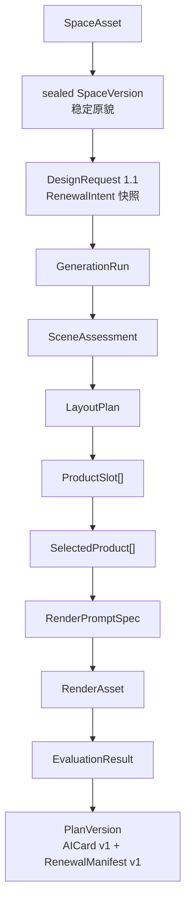
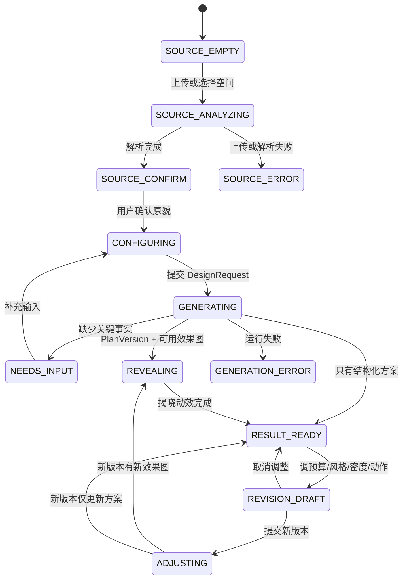

# 一角焕新：从“毛坯”到“精装”的产品重构实施方案

> 文档性质：下一阶段实施蓝图，不代表当前代码已经实现
> 基线版本：`0.5.2`
> 建议目标版本：`0.6.x`（比赛可演示闭环）→ `0.7.x`（结构保护与评测完善）
> 主入口：`apps/douyin-demo/douyin-static-demo/renewal.html`
> 更新日期：2026-07-25

## 1. 结论

这次不应推翻现有项目，而应进行“两层保留、两层替换”：

- 保留现有私有媒体、Asset、SpaceVersion、DesignRequest、GenerationRun、
  PlanAsset、PlanVersion 和事件体系；
- 保留现有抖音推荐流入口、视频上下文、收藏和历史抽屉；
- 替换前端以“选灵感、选空间、填表”为中心的叙事，把“原貌 → 焕新完成”的
  强烈对比变成唯一视觉主角；
- 替换后端正式链路中的固定 `planTemplates`，把 Prompt 实验台已经验证的
  `SceneAssessment → LayoutPlan → ProductSlot → RenderPromptSpec` 迁入持久
  GenerationRun，并补上 SelectedProduct、EvaluationResult 和一次受控返修；
- 把“效果图生成完成”从终点改为中点，增加独立
  `ProductDiscoveryRun → Commerce Catalog → CommerceAction` 后置链路，让用户
  知道画面中的元素可以买什么、去哪里买。

产品默认值建议冻结为：

```text
transformation_strength = high
visual_density = restrained
```

这两个维度必须分开：

- `transformation_strength` 决定前后变化是否明显；
- `visual_density` 决定物品数量和画面复杂度。

因此“强烈对比”不等于“堆很多东西”，“精装”也不等于“繁复”。默认体验应是
“变化明显，但新增克制、秩序完整”。

## 2. 产品边界

### 2.1 “毛坯”的准确含义

当前产品不具备真实硬装、拆墙、水电、施工测量和整屋设计能力。因此：

- 内部可以使用“毛坯 → 精装”描述产品反差；
- 面向用户优先使用“原貌 / 焕新后”“现在 / 完成后”；
- 不应让用户误以为产品可以对真正的建筑毛坯房完成硬装设计；
- 当前“毛坯”指未经整理、未经搭配、缺少完整设计的一角；
- 当前“精装”指家具结构不变前提下，完成整理、软装、照明和氛围层次。

### 2.2 P0 可信范围

P0 只承诺已经有数据、Prompt 和测试基础的局部空间：

1. 书桌角落；
2. 床头一角；
3. 客厅空角。

厨房、玄关、宿舍重复单元和有宠空间进入固定评测集，但没有通过固定案例前只显示
“实验支持”或“示例”。整屋、硬装、施工图、厘米级测量、真实交易和 AR 不进入
本轮承诺。P0 可以先通过 plan-grounded fallback 和 Demo Catalog 验证“效果图后
识别/关联商品 → 告诉用户如何搜索”的购买承接流程，但不得冒充真实抖音商城、
库存或交易已经接入。

### 2.3 一句话定位

> 上传一个真实角落，用极少的选择，看到一个结构不乱改、变化足够明显、还能照着落地的焕新结果。

## 3. 当前框架与改造判断

| 当前模块 | 当前事实 | 改造判断 |
| --- | --- | --- |
| 抖音推荐流 | 静态运行 Demo，能携带视频上下文进入焕新 | 保留入口，不在本轮重做推荐流 |
| `renewal.html` | 可持久联调单页，四态核心卡片 | 作为唯一主界面重构 |
| 收藏/历史抽屉 | 已接 `/api/v1` | 保留为次级能力 |
| 上传与空间确认 | 已接私有媒体、Asset、SpaceVersion | 保留协议，改视觉呈现 |
| DesignRequest | 不可变输入快照 | 扩展 `1.1` RenewalIntent |
| GenerationRun | 九阶段、轮询、取消、恢复 | 保留运行语义，增加 v2 stage |
| PlanVersion | 不可变版本和父子谱系 | 保留，新增 `renewal_manifest` |
| AICard v1 | 结果兼容视图 | 保留兼容，不继续承载所有新语义 |
| 正式 `workflow.js` | RoomProfile + 固定模板 + Demo 商品 | 退为 fallback |
| 正式流水线 | 动态规划 + ProductSlot + Seedream | 已迁入正式链路，继续收紧验收 |
| 商品 | 固定 Demo Catalog | P0 继续 Demo，并新增 after 图后置 ProductDiscoveryRun 协议；真实抖音目录仍后置 |
| 效果图 | 主方案可 Live，候选和预算调整可能复用示意 | 增加一致性状态，禁止静默冒充新图 |

## 4. 新对象模型与所有权



### 4.1 稳定基底

`SpaceVersion` 是本次焕新的稳定基底：

- 原图、机位和用户确认的空间事实固定；
- sealed 后不可修改；
- 更新照片或确认事实必须创建新 SpaceVersion；
- 所有 before/after 必须引用同一个 SpaceVersion；
- 前端不得为了制造反差替换原图、裁切视角或改变基线曝光。

### 4.2 独立可替换对象

- `ProductSlot` 是设计需求，不是商品；
- `SelectedProduct` 是经过目录和规则筛选的商品事实；
- `LayoutAction` 是放置、整理或移除动作；
- `RenderAsset` 是某个 PlanVersion 的渲染产物；
- `EvaluationResult` 是某次渲染的独立评测；
- 商品替换、动作关闭、风格调整均创建新 PlanVersion，不覆盖旧版本。

### 4.3 RenewalIntent

```json
{
  "goal_codes": ["organization", "ambient_lighting"],
  "user_note": "保留桌面设备，但希望看起来更完整",
  "transformation_strength": "high",
  "visual_density": "restrained",
  "style_mode": "auto",
  "style_codes": [],
  "palette_preferences": []
}
```

枚举建议：

- `transformation_strength`: `light | clear | high`
- `visual_density`: `restrained | balanced | layered`
- `style_mode`: `auto | reference | explicit`

P0 前端只需要暴露三个用户决策：

1. 想解决什么；
2. 预算；
3. 更克制还是更丰富。

“变化明显”默认打开，不做复杂的模型参数面板。

### 4.4 RenewalManifest

`AICard v1` 继续服务旧前端和结果兼容；新 UI 读取 PlanVersion 上的
`renewal_manifest`：

```json
{
  "schema_version": "1.0",
  "pipeline_version": "renewal-v2",
  "intent": {
    "transformation_strength": "high",
    "visual_density": "restrained",
    "goal_codes": ["organization", "ambient_lighting"]
  },
  "assessment": {
    "admissibility": "ready",
    "scene_type": "desk_corner",
    "primary_function": "学习与轻办公",
    "needs_confirmation": []
  },
  "design_direction": {
    "title": "克制但完整的暖光书桌",
    "summary": "保持桌椅和设备不动，通过收纳、焦点与氛围三层完成焕新",
    "focal_zone_id": "desktop_back",
    "palette": ["暖白", "深绿", "浅木"],
    "materials": ["棉麻", "哑光金属", "陶瓷"]
  },
  "change_layers": [
    {
      "layer": "functional",
      "status": "covered",
      "action_ids": ["action-01"]
    },
    {
      "layer": "focal",
      "status": "covered",
      "action_ids": ["action-02"]
    },
    {
      "layer": "atmosphere",
      "status": "covered",
      "action_ids": ["action-03"]
    }
  ],
  "actions": [],
  "product_slots": [],
  "selected_product_ids": [],
  "render": {
    "status": "ready",
    "consistency_status": "current",
    "before_ref": "asset://private-media/...",
    "after_ref": "asset://private-media/...",
    "comparison_mode": "same_frame"
  },
  "evaluation": {
    "overall_status": "pass",
    "hard_failures": [],
    "scores": {
      "base_fidelity": 0.91,
      "change_visibility": 0.86,
      "visual_coherence": 0.88,
      "physical_plausibility": 0.89,
      "constraint_compliance": 0.95,
      "clutter_risk": 0.12
    },
    "repair_count": 0
  },
  "provenance": {
    "scene_assessment": {"source_type": "live", "version": "scene-assessment-v2.0.0"},
    "layout_planning": {"source_type": "live", "version": "layout-planner-v2.0.0"},
    "product_catalog": {"source_type": "demo", "version": "demo-catalog-v1"},
    "render_generation": {"source_type": "live", "version": "doubao-seedream-5.0-lite"},
    "render_evaluation": {"source_type": "live", "version": "render-evaluator-v1.0.0"}
  }
}
```

完整 Prompt、原始模型响应和 Base64 不进入该对象。

## 5. 新主流程与状态机



### 5.1 Preview、保存、应用、取消与回滚

- 配置页所有改动属于本地 `DesignTaskDraft`，不修改后端事实；
- 点击“开始焕新”后创建不可变 DesignRequest；
- 运行中的取消调用现有 cancel 接口，已经发出的 Provider 请求不保证停止计费；
- 成功结果自动保存为 `PlanVersion`，默认 PlanAsset lifecycle 为 `draft`；
- 调整弹层使用本地 `RevisionDraft`，关闭或取消时不创建任何后端对象；
- 提交调整后创建派生 DesignRequest、GenerationRun 和新 PlanVersion；
- 旧 PlanVersion 永远保留；
- “恢复这一版”使用 `restore_version` 创建一个新版本，不把历史版本原地改成当前；
- 刷新页面只保存业务 ID 和未提交草稿，不保存 File、Base64、短时 URL 或 Prompt。

### 5.2 默认和空组合

- 无灵感图也必须可以完成自动焕新；
- 无用户风格输入时使用原空间的颜色、材质和光线建立方向；
- `high + restrained` 是默认组合；
- 没有足够安全空位时返回 `space_limited`，不得为了强反差强塞商品；
- 没有 after 图但有结构化方案时，结果页展示方案并明确“效果图未通过校验”；
- 旧 PlanVersion 没有 RenewalManifest 时继续使用 AICard 兼容渲染。

## 6. 前端修改方案

### 6.1 视觉方向

采用一个明确方向：

> 工地原貌感 × 家居杂志完成感

表现原则：

- 原貌侧使用冷灰、结构线、编号和较硬的排版；
- 完成侧使用当前项目已有的奶油纸、苔绿、陶土橙和宋体编辑感；
- 主界面保持克制，不用大量渐变、发光和同权卡片；
- 反差主要来自同一张空间图的 before/after，而不是界面装饰；
- 保留当前无 CDN、无外部字体依赖；
- 只保留一个高影响动效：结果揭晓；
- `prefers-reduced-motion` 下直接显示静态 50/50 对比。

现有纸张米色、苔绿和陶土橙可以继续使用，但应减少卡片阴影和边框数量，让空间图
占据首屏主要面积。

### 6.2 信息层级

当前顺序：

```text
灵感 → 空间 → 约束 → 生成 → 结果
```

目标顺序：

```text
原貌舞台 → 三项焕新意图 → 开始焕新 → 结果揭晓
                                      ↓
                          变化解释 / 清单 / 继续调整
```

价格和商品清单不再抢占结果首屏。结果首屏必须先回答：

1. 变化有多明显；
2. 什么被保留；
3. 为什么这个结果仍然像“我家”。

### 6.3 页面布局

#### A. SOURCE_EMPTY

- 首屏 65% 以上区域为上传/复用空间入口；
- 主文案：“给我一个原貌，还你一个完成的一角”；
- 三个入口：拍摄/上传、使用最近空间、从当前视频获得灵感；
- 收藏和历史保留在底部，不与上传入口同权；
- 不在空状态展示完整预算和约束表单。

#### B. SOURCE_CONFIRM

- 原图成为主舞台；
- 用少量轮廓或标签显示“保持不动”“可以焕新”；
- 只让用户确认会影响结果的事实；
- 未确认的家具默认保留；
- 主按钮：“确认原貌，继续焕新”。

#### C. CONFIGURING

采用底部控制台而不是三张大表单：

- 目标：整理收纳 / 灯光氛围 / 展示焦点 / 自定义；
- 预算：保留现有滑杆；
- 丰富度：克制 / 平衡 / 层次；
- “变化明显”作为默认产品承诺，不放成技术参数；
- 灵感作为可选附件，显示为一枚可移除的引用卡；
- 免打孔、租房和宠物放入“生活边界”折叠区。

#### D. GENERATING

- 原图保持可见，不切到空白加载页；
- 进度文案改为用户能理解的工作：
  `看懂原貌 → 确定重点 → 组织三层变化 → 匹配物品 → 生成效果 → 可信校验`；
- 来源细节放入“查看过程”，主进度不展示内部英文枚举；
- 提供取消；
- 后台失败时保留已经完成的结构化阶段，不要求用户重新选择所有输入。

#### E. REVEALING / RESULT_READY

- 首屏全幅 before/after；
- 首次进入先显示原图，约 700–1000ms 后完成一次揭幕；
- 拖动滑块保持同一构图；
- 首屏只放标题、来源诚实标识和三个动作：
  `看变化`、`继续调整`、`查看落地清单`；
- 价格、商品和校验下移；
- 显示功能、焦点、氛围三层变化，不能只显示“6 件商品”；
- 在效果图和变化摘要之后增加“把这一角搬回家”，异步恢复或创建
  ProductDiscoveryRun；先说明画面中识别/关联到什么，再提供真实跳转、网页、搜索词
  或不可购买状态；
- 评测未通过的 after 图不展示；
- 预算调整未重新生图时标记“清单已更新，效果图仍为上一版”，不得静默复用。

### 6.4 前端组件改造

| 文件/组件 | 修改 |
| --- | --- |
| `renewal.html` | 把核心卡片改为原貌/结果共用舞台；左侧介绍改为“原貌 → 焕新 → 落地” |
| `renewal/main.js` | 从四态协调器升级为显式状态机；把上传解析与生成恢复分开 |
| `renewal/renewal-store.js` | 增加 `flowState`、`renewalIntent`、`revisionDraft`、`revealPlayedForVersionId` |
| `components/space-picker.js` | 改为 `source-stage.js`，承担空状态、原图和确认 |
| `components/constraint-bar.js` | 改为 `renewal-control-panel.js`，分离强度和密度 |
| `components/inspiration-bar.js` | 降级为可选的 `reference-chip` |
| `components/result-section.js` | 改为 `transformation-stage.js`，before/after 为首屏 |
| 新增 `components/change-layer-list.js` | 展示功能、焦点、氛围三层变化 |
| 新增 `components/revision-sheet.js` | 本地调整草稿、Apply/Cancel |
| 新增 `components/needs-input-panel.js` | 结构化追问并回填草稿 |
| 新增 `components/shop-the-look.js` | 效果图后置识别、商品候选和抖音购买/搜索承接 |
| 新增 `adapters/renewal-manifest-view-model.js` | RenewalManifest → UI ViewModel |
| 新增 `adapters/product-discovery-view-model.js` | ProductDiscoveryRun → 购买承接 ViewModel |
| `adapters/plan-version-view-model.js` | 兼容 v1.0 AICard 与 v1.1 RenewalManifest |
| `api/v1-client.js` | 支持 DesignRequest 1.1、Run 1.1 和 tune/restore revision |
| 新增 `api/product-discovery-client.js` | 创建、恢复、轮询和取消 ProductDiscoveryRun |
| `renewal/styles/renewal.css` | 建立 raw/refined 双状态 token，减少 card soup |

不要继续扩展已经退出主路径的 `me.js` Mock 和旧 `router.js`。

### 6.5 Store 建议形状

```js
{
  flowState: "SOURCE_EMPTY",
  selectedSpace: null,
  selectedInspiration: null,
  renewalIntent: {
    goal_codes: ["organization", "ambient_lighting"],
    user_note: "",
    transformation_strength: "high",
    visual_density: "restrained",
    style_mode: "auto",
    style_codes: []
  },
  constraints: {
    budget_cny: 500,
    no_drilling: true,
    rental: true,
    pet_context: "none",
    preserve_detected_object_ids: [],
    removable_detected_object_ids: []
  },
  currentGenerationRun: null,
  currentPlanVersion: null,
  revisionDraft: null,
  revealPlayedForVersionId: null,
  ui: {
    drawerOpen: null,
    sheetOpen: null,
    comparePosition: 50,
    toast: null
  }
}
```

只有 `DesignTaskDraft` 和最小业务 ID 可以进入 sessionStorage。

### 6.6 前端验收

- 430×900、390×844 和 1440×900 无横向溢出；
- 首屏不滚动即可完成空间选择并理解产品价值；
- 结果首屏图片面积大于价格和清单面积；
- `high + restrained` 在 UI 上不会被误解为“东西更多”；
- `needs_input`、后端离线、规划失败、渲染失败和评测失败都有独立状态；
- 刷新可恢复 active run 或 PlanVersion；
- 旧 v1.0 方案仍可打开；
- reduced motion、键盘滑块、焦点态和图片 alt 可用。

## 7. 后端修改方案

### 7.1 目标工作流

```text
1 validate_input
2 assess_scene
3 compile_intent
4 plan_layout
5 validate_and_repair_plan
6 retrieve_products
7 build_render_spec
8 render_image
9 evaluate_and_repair_render
10 package_version
```

当前 `PlanService.process()` 只在 `planning` 阶段真正执行整个旧 workflow。目标是每个
阶段产生可持久的结构化 artifact，并在重启后从安全阶段恢复。

### 7.2 模块所有权

| 模块 | 目标职责 |
| --- | --- |
| `PlanService` | 状态机、actor、幂等、取消、恢复、PlanVersion 持久化 |
| 新 `RenewalPipeline` | 按阶段调度，不直接拥有 Repository |
| `room-analyzer.js` | SceneAssessment，只提取事实 |
| `layout-planner.js` | LayoutPlan + ProductSlot，不拥有商品事实 |
| 新 `product-retriever.js` | ProductSlot → Candidate → SelectedProduct |
| `packages/validation` | 预算、尺寸、安装、宠物、结构和完整度硬校验 |
| 新 `render-spec-builder.js` | 结构化输入 → 唯一 RenderPromptSpec |
| `render-generator.js` | 只执行 RenderPromptSpec |
| 新 `render-evaluator.js` | before/after/plan → EvaluationResult |
| `workflow.js` | 旧 AICard 兼容和 Demo fallback，退出 live 主规划 |

### 7.3 Artifact 持久化

建议增加 `generation_run_artifacts` Repository 类型：

```text
artifact_id
generation_run_id
actor_id
kind
schema_version
template_version
input_hash
output_hash
data_json
created_at
```

`kind`：

- `scene_assessment`
- `renewal_intent`
- `layout_plan`
- `selected_products`
- `render_prompt_spec`
- `render_asset`
- `evaluation_result`

不把图片 Base64、完整 Provider 原文或 API Key 写入 `data_json`。图片仍由
MediaService 保存，Artifact 只引用 `media_id`。

### 7.4 规划硬校验

代码必须拥有以下门禁：

```text
现有家具修改动作 = 0
固定结构修改动作 = 0
transformation_strength=high 时覆盖区域 >= 2
functional/focal/atmosphere 三层均 covered
visual_density=restrained 时 ProductSlot 建议 2–4，最大 4
visual_density=balanced 时 ProductSlot 建议 3–5，最大 5
不能全部属于单一收纳类别
每个 add action 有 support 和 clearance
ProductSlot 不含品牌/SKU/价格/库存/链接
SelectedProduct 总价 <= budget
硬约束失败时不进入 Seedream
```

第一次规划不合格时只允许一次结构化返修；第二次仍失败则 GenerationRun 失败或返回
`needs_input`，不得继续生图。

### 7.5 渲染一致性

`render.consistency_status`：

- `current`：效果图与本 PlanVersion 的动作和商品一致；
- `stale`：方案已变化，但用户选择不重新生图；
- `unavailable`：没有效果图或效果图未通过校验；
- `rejected`：生成过，但因硬失败不向前端展示。

任何会改变可见物品、布局动作、风格、密度或强度的 revision 默认
`render_policy=regenerate`。若为了比赛成本选择 `reuse`，必须返回 `stale`。

### 7.6 评测与返修

硬失败：

- 不是同一空间或机位；
- 家具几何、门窗或固定结构明显变化；
- 计划外新增大件；
- 阻挡柜门、抽屉、座位、设备或通道；
- 悬空、穿插、比例严重错误；
- 商品事实被伪造；
- 非家居场景被生成成住宅。

软评分：

- `change_visibility`
- `visual_coherence`
- `base_fidelity`
- `physical_plausibility`
- `constraint_compliance`
- `clutter_risk`

建议初始门槛：

```text
base_fidelity >= 0.85
change_visibility >= 0.72
visual_coherence >= 0.70
physical_plausibility >= 0.80
constraint_compliance >= 0.90
clutter_risk <= 0.35
hard_failures.length = 0
```

阈值必须通过固定评测集校准，不能把上述初始值直接描述为生产标准。自动重绘最多
一次；重绘后仍失败则隐藏 after 图，保留结构化方案。

### 7.7 保护机制

Prompt 不能保证家具像素级不变。分两级实施：

- `0.6.x`：结构化 preserve 清单 + negative constraints + after 图评测和拒绝；
- `0.7.x`：增加建筑/家具保护 mask 或局部图层合成，再承诺更强的结构保持。

在 mask 上线前，用户文案只能说“尽量保持原有结构和家具”，不能说“保证不变”。

## 8. Prompt 修改方案

### 8.1 Prompt 包与版本

目标拆为五个版本化单元：

| Prompt/Builder | 版本 | 作用 |
| --- | --- | --- |
| Scene Assessment | `scene-assessment-v2.0.0` | 场景准入和事实提取 |
| Layout Planning | `layout-planner-v2.0.0` | 三层焕新规划与 ProductSlot |
| Layout Repair | `layout-repair-v1.0.0` | 只修确定性失败项 |
| Render Spec Builder | `render-spec-builder-v2.0.0` | 纯代码编译，不调用模型 |
| Render Evaluation | `render-evaluator-v1.0.0` | before/after 结构化评测 |

旧 `layout-agent-v1.2.0` 与 Prompt Lab 已移除；正式版本只由
`renewal-v2.js` 管理。

### 8.2 Scene Assessment Prompt

输入：

- 原图；
- 用户确认的参考宽度；
- 画质提示；
- 允许的 scene ontology。

System 核心约束：

```text
你只负责提取照片中可见的空间事实，不负责设计。
不得提出商品、预算、风格、施工或改造建议。
不得估算用户未确认的厘米尺寸。
无法确定时写入 uncertainties，不得补全画外空间。
非家居、严重模糊、无可靠承重面时返回 needs_input。
只输出符合 SceneAssessment Schema 的 JSON。
```

输出至少包含：

```json
{
  "status": "ready",
  "scene_type": "desk_corner",
  "primary_function": "学习与轻办公",
  "fixed_structures": [],
  "existing_furniture": [],
  "functional_equipment": [],
  "loose_items": [],
  "clear_addition_zones": [],
  "supports": [],
  "clearances": [],
  "lighting": {},
  "uncertainties": [],
  "needs_confirmation": []
}
```

建议初始参数：`temperature=0.1`、JSON object/schema mode、受限输出长度。模型输出仍
必须经过本地协议校验。

### 8.3 Layout Planning Prompt

输入不再只是一张图，而是：

```text
SceneAssessment
+ RenewalIntent
+ UserConstraints
+ PreferenceSnapshot
+ 可选 InspirationProfile
+ 原图（仅用于核对证据）
```

System 中必须明确：

```text
transformation_strength=high 表示前后变化必须清晰覆盖至少两个区域，
不代表允许移动家具、改变空间或增加更多物品。

visual_density=restrained 表示新增克制、保留留白，通常 2–4 个 ProductSlot。
必须通过功能、焦点、氛围三个层次获得完整感，而不是通过堆砌获得变化。

现有家具和固定结构是几何锁定对象。
只允许 organize_loose_items、remove_trash、add。
商品阶段只输出 ProductSlot，不得生成品牌、价格、库存、SKU 和链接。
```

输出扩展：

```json
{
  "status": "ready",
  "space_limited": false,
  "problems": [],
  "design_direction": {},
  "change_layers": [
    {"layer": "functional", "zone_ids": [], "action_ids": []},
    {"layer": "focal", "zone_ids": [], "action_ids": []},
    {"layer": "atmosphere", "zone_ids": [], "action_ids": []}
  ],
  "actions": [],
  "product_slots": [],
  "negative_constraints": []
}
```

### 8.4 Layout Repair Prompt

Repair 不重做整个方案，只接收：

- 原始 LayoutPlan；
- 确定性失败列表；
- 不允许改变的字段路径；
- 同一 SceneAssessment 和 Intent。

示例：

```json
{
  "failed_checks": [
    {"code": "missing_atmosphere_layer", "path": "/change_layers"},
    {"code": "single_category_only", "path": "/product_slots"}
  ]
}
```

Prompt 明确“只修改失败字段；不得扩大编辑区域；不得增加新家具修改动作”。返回后
完整重跑确定性校验。

### 8.5 商品检索与排序

P0 使用 Demo Catalog，但接口和数据流按真实检索设计：

```text
ProductSlot
→ category/query 召回
→ 尺寸/预算/库存/安装/宠物硬过滤
→ 可选模型排序
→ SelectedProduct
```

可选排序 Prompt 只能接收候选 ID 和可信字段，只能返回候选 ID 顺序与解释；不能
修改任何商品事实。

### 8.6 RenderPromptSpec 与 Seedream Prompt

单一 Builder 输入：

```json
{
  "scene_assessment_id": "...",
  "layout_plan_id": "...",
  "preserve": [],
  "actions": [],
  "selected_products": [],
  "camera_lock": {},
  "lighting_policy": {},
  "negative_constraints": []
}
```

Builder 输出 `RenderPromptSpec`，再由 Provider adapter 编译为字符串。项目只维护
正式流水线这一套 Render Prompt。

Seedream 指令顺序固定：

1. 原图和机位锁定；
2. 建筑与家具保护；
3. 允许执行的动作；
4. SelectedProduct 的可用视觉事实；
5. 承重、避让、比例和光影；
6. 禁止计划外修改；
7. 输出格式。

Prompt 中不出现未经检索的价格、库存和“同款”结论。

### 8.7 Render Evaluation Prompt

输入：

- before 图；
- after 图；
- SceneAssessment；
- LayoutPlan；
- SelectedProduct 摘要。

输出：

```json
{
  "overall_status": "pass",
  "hard_failures": [],
  "scores": {
    "base_fidelity": 0.91,
    "change_visibility": 0.86,
    "visual_coherence": 0.88,
    "physical_plausibility": 0.89,
    "constraint_compliance": 0.95,
    "clutter_risk": 0.12
  },
  "missing_actions": [],
  "unexpected_changes": [],
  "repair_instruction": null
}
```

模型评分不能替代代码预算、库存和状态校验。评测失败也不能通过“平均分较高”覆盖
家具几何等硬失败。

### 8.8 Prompt 隐私与追踪

- API 和前端只接收 Prompt 版本、模型版本、hash 和阶段来源；
- 完整 Prompt、原始响应、图片 Base64 和用户原图不进入日志；
- RenderPromptSpec 可以私有持久化，完整字符串按模板确定性重建；
- 每次 Prompt 修改必须跑固定评测集并记录前后差异；
- 真实模型检查只人工单次触发，不进入普通自动测试。

## 9. API 修改方案

### 9.1 兼容策略

不新建 `/api/v2`，继续使用 `/api/v1` 路由，通过对象
`schema_version: "1.0" | "1.1"` 做并行兼容：

- 旧前端继续提交和读取 `1.0`；
- 新焕新前端提交 `1.1`；
- AICard v1 保持；
- PlanVersion 1.1 增加 `renewal_manifest`；
- 旧 PlanVersion 无该字段时前端走兼容 Adapter；
- `packages/contracts` 同时保留两套 fixture；
- OpenAPI 使用 `oneOf` 描述 v1.0/v1.1。

### 9.2 保留的接口

以下路由无需新增，只扩展请求或响应：

```text
POST /api/v1/media
POST /api/v1/assets
PATCH /api/v1/assets/{asset_id}/versions/{space_version_id}
POST /api/v1/design-requests
POST /api/v1/design-requests/{design_request_id}/runs
GET  /api/v1/generation-runs/{generation_run_id}
POST /api/v1/generation-runs/{generation_run_id}/cancel
GET  /api/v1/plans
GET  /api/v1/plans/{plan_asset_id}
GET  /api/v1/plans/{plan_asset_id}/versions/{plan_version_id}
POST /api/v1/plans/{plan_asset_id}/revisions
PATCH /api/v1/plans/{plan_asset_id}
POST /api/v1/events/batch
```

本轮不需要为每个前端按钮新建接口。

### 9.3 创建 DesignRequest 1.1

`POST /api/v1/design-requests`

```json
{
  "schema_version": "1.1",
  "trigger": "space_reuse",
  "space_asset_id": "space-001",
  "space_version_id": "space-version-001",
  "reference_asset_ids": [],
  "intent": {
    "goal_codes": ["organization", "ambient_lighting"],
    "user_note": "保留电脑和书，想让画面更完整",
    "transformation_strength": "high",
    "visual_density": "restrained",
    "style_mode": "auto",
    "style_codes": [],
    "palette_preferences": []
  },
  "constraints": {
    "budget_cny": 500,
    "no_drilling": true,
    "rental": true,
    "pet_context": "none",
    "preserve_detected_object_ids": ["detected-desk-01"],
    "removable_detected_object_ids": []
  },
  "editable_region_id": "desktop-and-back-wall",
  "options": {
    "pipeline_version": "renewal-v2",
    "analysis_mode": "auto",
    "render_mode": "preview",
    "include_trace": true
  }
}
```

响应：

```json
{
  "schema_version": "1.1",
  "design_request_id": "design-request-001",
  "validation_state": "valid",
  "can_start_generation": true,
  "missing_fields": [],
  "input_snapshot_summary": {
    "space_asset_id": "space-001",
    "space_version_id": "space-version-001",
    "reference_asset_ids": [],
    "resolved_budget_cny": 500,
    "budget_source": "request",
    "transformation_strength": "high",
    "visual_density": "restrained",
    "pipeline_version": "renewal-v2"
  },
  "created_at": "2026-07-25T12:00:00.000Z"
}
```

### 9.4 GenerationRun 1.1

创建仍使用：

`POST /api/v1/design-requests/{design_request_id}/runs`

轮询响应增加新 stage，不复用错误语义的旧 phase：

```json
{
  "schema_version": "1.1",
  "generation_run_id": "generation-run-001",
  "design_request_id": "design-request-001",
  "status": "running",
  "stage": "plan_layout",
  "stage_index": 4,
  "stage_total": 10,
  "progress": 38,
  "source_mode": null,
  "retryable": false,
  "needs_input": null,
  "result": null,
  "error": null,
  "created_at": "2026-07-25T12:00:02.000Z",
  "updated_at": "2026-07-25T12:00:08.000Z"
}
```

`stage` 枚举：

```text
validate_input
assess_scene
compile_intent
plan_layout
validate_plan
retrieve_products
build_render_spec
render_image
evaluate_render
package_version
```

旧 `1.0` run 继续使用当前 `phase/phase_index/phase_total`。前端 Adapter 同时处理。

### 9.5 PlanVersion 1.1

原接口保持：

`GET /api/v1/plans/{plan_asset_id}/versions/{plan_version_id}`

```json
{
  "schema_version": "1.1",
  "plan_asset_id": "plan-001",
  "plan_resource_version": 2,
  "plan_version": {
    "plan_version_id": "plan-version-002",
    "version": 2,
    "parent_plan_version_id": "plan-version-001",
    "design_request_id": "design-request-002",
    "generation_run_id": "generation-run-002",
    "design_request_snapshot": {},
    "revision_action": {},
    "source_mode": "live",
    "redactions": [],
    "aicard": {},
    "renewal_manifest": {},
    "created_at": "2026-07-25T12:01:00.000Z",
    "updated_at": "2026-07-25T12:01:00.000Z"
  }
}
```

### 9.6 统一调整接口

`POST /api/v1/plans/{plan_asset_id}/revisions`

旧 `reduce_budget`、`change_style` 保留。新增：

```json
{
  "schema_version": "1.1",
  "parent_plan_version_id": "plan-version-002",
  "action": {
    "type": "tune",
    "changes": {
      "budget_cny": 400,
      "transformation_strength": "high",
      "visual_density": "restrained",
      "style_mode": "explicit",
      "style_codes": ["warm_editorial"],
      "locked_action_ids": ["action-01"],
      "disabled_action_ids": ["action-04"]
    },
    "render_policy": "regenerate"
  }
}
```

`render_policy`：

- `regenerate`：创建新效果图并评测；
- `reuse`：不调用图片模型，但新版本的 render 标记 `stale`；
- `auto`：后端根据可见变化判断；建议前端默认 `auto`。

恢复旧版本：

```json
{
  "schema_version": "1.1",
  "parent_plan_version_id": "plan-version-004",
  "action": {
    "type": "restore_version",
    "source_plan_version_id": "plan-version-002",
    "render_policy": "reuse"
  }
}
```

### 9.7 Health 能力声明

现有 `/api/health` 增加：

```json
{
  "features": {
    "renewal_pipeline_v2": true,
    "renewal_manifest_v1": true,
    "render_evaluation": true,
    "structure_protection_mask": false
  },
  "pipeline_versions": ["legacy-v1", "renewal-v2"]
}
```

前端不得仅通过能否请求某个 URL 猜测能力。

### 9.8 错误和业务结果

| 场景 | HTTP/Run 语义 | 前端处理 |
| --- | --- | --- |
| 非家居/关键事实缺失 | Run `succeeded` + `needs_input` | 回到确认或配置，不当作系统崩溃 |
| SceneAssessment 非法 JSON | Run `failed`, retryable | 显示可重试 |
| 规划两次校验失败 | Run `failed` 或 `needs_input` | 不调用 Seedream |
| 商品无可用候选 | `needs_input` 或结构化方案缺货 | 不让模型伪造商品 |
| 渲染失败 | Plan 可成功，render unavailable | 展示结构化方案 |
| 渲染硬评测失败 | render rejected | 不展示失败图 |
| 父版本过期 | `409 stale_parent_plan_version` | 拉取最新谱系后让用户确认 |
| 同方案正在调整 | `409 plan_revision_in_progress` | 恢复 active run |
| 资源版本冲突 | `409 resource_version_conflict` | 重拉后重放用户意图 |
| 上传过大 | `413` | 上传前后都给出限制 |
| 限流 | `429` | 保留草稿并允许稍后重试 |

### 9.9 幂等和隐私

- 所有标记 idempotent 的 mutation 必须携带 `Idempotency-Key`；
- actor 继续由服务端身份上下文拥有；
- 请求体不得含 `owner_id`；
- 原图通过 private media 和短时 URL；
- 前端不接收完整 Prompt 和 Provider 原始正文；
- 事件只上传白名单字段，不上传原图、自由文本和短时 URL。

## 10. 分阶段实施与完成标准

### Gate 0：冻结基线

工作：

- 固定当前两个书桌演示；
- 保存 v1.0 请求、响应和浏览器截图；
- 确认用户实际查看的是仓内 `renewal.html` 与当前后端；
- 保留当前全量测试结果。

完成标准：

- 当前 `npm.cmd run check` 与 `npm.cmd run check:douyin-integration` 可重复通过；
- v1.0 fixture 不再随重构漂移。

### Gate 1：协议和领域对象

工作：

- 增加 DesignRequest 1.1、GenerationRun 1.1、RenewalManifest；
- 增加 SceneAssessment、LayoutPlan、ProductSlot、RenderPromptSpec、
  EvaluationResult 校验；
- 增加 v1.0/v1.1 oneOf OpenAPI。

完成标准：

- 非法家具动作、伪造商品事实和不完整三层方案被纯代码拒绝；
- 同一结构化输入可以稳定构造唯一 RenderPromptSpec；
- 不调用真实模型。

### Gate 2：前端结果舞台

工作：

- 使用固定 v1.1 fixture 重做 SOURCE/CONFIGURING/REVEAL/RESULT；
- 完成 raw/refined 双视觉状态；
- 完成 RevisionDraft 的 Apply/Cancel；
- 兼容旧 AICard。

完成标准：

- 无后端模型调用也能完整演示“原貌 → 精装结果”的主叙事；
- 首屏层级、移动端和 reduced motion 验收通过。

### Gate 3：正式动态规划

工作：

- SceneAssessment 泛化；
- 正式 Layout Planner 接入 RenewalPipeline；
- 接 Demo ProductSlot 检索；
- 一次规划返修；
- 正式 PlanVersion 持久 RenewalManifest。

完成标准：

- 同一张图不再固定落到书桌模板；
- 非家居和无安全空位不调用 Seedream；
- 结果可刷新、可恢复、可版本化。

### Gate 4：统一渲染与评测

工作：

- 合并两个 Render Prompt Builder；
- 接 Seedream 主方案；
- 增加 EvaluationResult 和一次受控重绘；
- 增加 current/stale/unavailable/rejected。

完成标准：

- 每张公开 after 图都能追溯到本版本动作和商品；
- 家具几何硬失败不会展示；
- 预算调整复用旧图时明确标记 stale。

### Gate 5：调整闭环与比赛验收

工作：

- tune/restore revision；
- 版本切换；
- active run 恢复；
- 按 `docs/product-discovery-api-contract.md` 接入 after 图后置商品发现，至少跑通
  plan-grounded fallback、Demo Catalog 和搜索词购买动作；
- 比赛固定案例与来源标识；
- 清理退出主路径的 Mock 和重复大资源。

完成标准：

- 初始结果 → 调预算/密度/风格 → 新版本 → 查看旧版本 → 恢复版本全链路成立；
- 效果图揭晓 → 商品识别/关联 → Demo/Live 来源说明 → 去抖音搜的承接链路成立；
- 断网、模型失败和后端失败有诚实降级；
- 3 分钟演示不需要解释内部工程结构。

### Gate 6：生产前能力

不属于比赛 P0：

- 真实登录、限流和多租户；
- 保护 mask；
- 真实商城、库存和交易；
- 外部队列、多进程竞争和监控；
- 滥用防护、成本配额和审计；
- 公网发布与隐私合规评审。

## 11. 测试矩阵

### 11.1 前端

- 状态机每条允许/禁止转换；
- v1.0/v1.1 Adapter；
- RevisionDraft Apply/Cancel；
- active run 迟到响应隔离；
- before/after 滑块；
- stale/rejected/unavailable；
- needs_input 回填；
- 390、430、1440 三种视口；
- reduced motion 与键盘操作。

### 11.2 后端

- 每个 Artifact Schema；
- 场景准入；
- 高强度与克制密度的组合校验；
- 三层覆盖；
- ProductSlot 禁止商品事实；
- ProductSlot → SelectedProduct 硬过滤；
- 预算、安装、宠物和保留物；
- 规划一次返修上限；
- RenderPromptSpec 确定性快照；
- 评测硬失败与图片拒绝；
- 运行取消、恢复、幂等；
- PlanVersion 父子谱系和 409；
- v1.0 兼容。

### 11.3 固定视觉评测

沿用并扩充现有固定集：

- 杂乱书桌；
- 宿舍重复书桌/床位；
- 卧室床头；
- 客厅空角；
- 小玄关；
- 厨房台面；
- 有宠空间；
- 低预算；
- 非家居教室；
- 无安全空位；
- 模糊/局部图；
- Provider 超时和非法 JSON。

每个案例记录 Prompt 版本、模型版本、阶段来源、调用次数、耗时、硬失败、评分和
是否返修。视觉评分必须保留人工复核，不只看模型自评。

## 12. 主要风险与控制

| 风险 | 控制 |
| --- | --- |
| 强反差导致原家具被重绘 | preserve 结构化清单、评测拒绝，下一阶段加 mask |
| “精装”变成商品堆砌 | 强度和密度分离，三层覆盖与品类多样性校验 |
| UI 过度装饰抢走结果 | 图片占主导，只保留一次揭晓动效 |
| Prompt 继续承担价格/库存 | ProductSlot 与 SelectedProduct 分离，代码硬过滤 |
| 预算调整继续复用旧图冒充新图 | render consistency_status |
| 候选方案看似都实时生成 | 每阶段独立 provenance |
| 前后不是同一构图，反差不可信 | SpaceVersion 稳定基底和 same_frame 评测 |
| 旧数据打不开 | AICard v1 保留，v1.0/v1.1 Adapter |
| 模型失败要求用户重填 | DesignRequest 和阶段 Artifact 持久化 |
| 比赛演示承诺超过真实能力 | P0 场景白名单与 Demo/Live/Fallback 明示 |

## 13. 建议立刻冻结的六项产品决策

1. “毛坯”是内部产品隐喻，面向用户默认写“原貌”；
2. 默认组合是 `high + restrained`；
3. 结果首屏先看 before/after，价格和商品退到第二层；
4. P0 只承诺局部软装焕新，不承诺硬装和整屋；
5. AICard v1 继续兼容，新语义进入 RenewalManifest，不再向一个 DTO 无限堆字段；
6. 效果图不是终点；购买承接是独立后置运行，Agent 只识别需求，商品事实和购买
   动作必须来自目录与确定性代码。

## 14. 效果图后置商品发现与抖音购买承接

共享协议见：

- `docs/product-discovery-api-contract.md`
- `docs/product-discovery-frontend-handoff.md`
- `docs/product-discovery-backend-handoff.md`

目标链路：


对象边界：

- ProductDiscoveryRun 引用不可变 PlanVersion，不修改 PlanVersion；
- 图像 Agent 只输出视觉元素、bbox、外观属性和商品搜索词；
- Agent 不得输出 product_id、价格、库存和链接；
- Commerce Catalog Adapter 拥有真实商品事实；
- bbox 缺失时前端不显示伪造热点；
- Prompt 和真实抖音目录未接入时，允许使用 plan-grounded fallback 和 Demo Catalog，
  但必须逐阶段标明来源。

计划接口：

```text
POST /api/v1/plans/{plan_asset_id}/versions/{plan_version_id}/product-discovery-runs
GET  /api/v1/plans/{plan_asset_id}/versions/{plan_version_id}/product-discovery-runs
GET  /api/v1/product-discovery-runs/{product_discovery_run_id}
POST /api/v1/product-discovery-runs/{product_discovery_run_id}/cancel
```

该能力当前尚未实现；正式 `docs/openapi.yaml` 仍只描述已落地接口。前后端应分别从
两份独立交接文档开工，并以共享 request/response fixtures 为联调事实。
