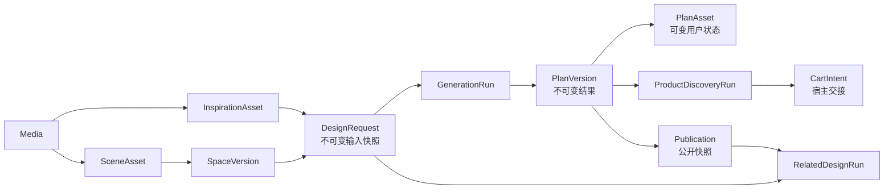

# 「搬进我家」V2.1 并行开发协议

> 协议代号：`renewal-card/2.1`
> 状态：目标契约，未进入 `docs/openapi.yaml` 的路由均不得宣称已实现
> 产品事实源：仓库上级目录 `一角焕新_新产品流程与Agent方案_V2.md`（V2.1，2026-07-25）
> 工程事实源：当前仓库代码、`HANDOFF.md`、生成后的 `docs/openapi.yaml`
> 配套任务：`v2-frontend-tasks.md`、`v2-backend-tasks.md`

本文冻结前后端可并行开发的对象、状态、接口和协作边界。产品文档决定“做什么”，
本文决定“双方如何连接”，OpenAPI 只描述“当前已经能调用什么”。三者冲突时：

1. 用户体验取产品 V2.1；
2. 新开发字段和状态取本文；
3. 运行时可用性取当前 Commit 生成的 OpenAPI 与 `/api/health`；
4. 未被健康能力声明的目标接口，只能使用明确标注的 fixture，不能静默假装 Live。

## 1. 当前基线与本轮目标

当前工作树不是干净基线，包含尚未提交的 Product Discovery 前后端、协议和测试。
前后端拆线前必须先形成一个双方都能检出的基线 Commit，并记录 SHA。仅记录旧
Commit `eb71e849c97aecd8532cfbe40d52123f863cc803` 不够，因为它不包含当前工作树全部
实现。没有基线 Commit 时，不得创建两个独立 worktree 开始开发。

| 能力 | 当前成熟度 | V2.1 目标 |
| --- | --- | --- |
| Media / Asset / SpaceVersion | 已实现、可持久联调 | 复用；补意图解析与确认字段 |
| DesignRequest / GenerationRun / PlanVersion | 已实现、可持久联调 | 复用；场景切换创建新请求 |
| ProductDiscoveryRun | 当前工作树已实现，尚待形成基线 Commit | 复用为“实施清单”底座，补来源排序 |
| 视频圈选 | 前端交互 Demo | 接入 InspirationAsset 解析，不把候选当真实商品 |
| 组件 / 风格意图 | 只有旧 `inspiration_scope`，没有确认协议 | 新增可纠正的确认快照 |
| 相关设计 | 未实现 | 独立异步 run，与效果图并发 |
| 方案保存 | PlanAsset `lifecycle=saved` 已实现 | 直接复用 |
| 方案发布 / 回流索引 | 未实现 | 新增不可变 Publication |
| 整套加入购物车 | 未实现真实宿主交易 | 新增经后端校验的 cart handoff，不创建订单 |

本轮目标成熟度是“可持久、可恢复的比赛 P0 集成原型”，不是生产级推荐、交易或
真实抖音全量接入。预算、不打孔、宠物和手动风格编辑均不出现在 V2.1 P0 主界面；
后端可以保留内部保护上限，但不得因此在主流程要求用户补预算。

## 2. 对象模型和所有权



| 对象 | 稳定身份 | 所有者 | 可变性 |
| --- | --- | --- | --- |
| `Media` | `media_id` | MediaService | 内容不可变，访问令牌可刷新 |
| `InspirationAsset` | `asset_id` | AssetService | 身份稳定；解析结果和用户确认受版本控制 |
| `SceneAsset` | `asset_id` | AssetService | 名称、默认状态、生命周期可变 |
| `SpaceVersion` | `space_version_id` | AssetService | sealed 后不可变 |
| `DesignRequest` | `design_request_id` | DesignRequestService | 创建后完全不可变 |
| `GenerationRun` | `generation_run_id` | PlanService | 只按状态机推进 |
| `RelatedDesignRun` | `related_design_run_id` | RelatedDesignService | 只按状态机推进 |
| `PlanAsset` | `plan_asset_id` | PlanService | 只拥有保存/归档等用户状态 |
| `PlanVersion` | `plan_version_id` | PlanService | 不可变 |
| `ProductDiscoveryRun` | `product_discovery_run_id` | ProductDiscoveryService | 只按状态机推进，不修改 PlanVersion |
| `Publication` | `publication_id` | PublicationService | 发布快照不可变；可撤下但不改写 |
| `CartIntent` | `cart_intent_id` | CommerceHandoffService | 短时、一次交接；不是订单 |

### 2.1 必须分开的对象

- 圈选结果是 `InspirationAsset`；收藏为以后复用的具体物件才是 `ItemAsset`。
- 场景身份是 `SceneAsset`；一次确认后的场景事实是 `SpaceVersion`。
- 生成输入是 `DesignRequest`；生成尝试是 `GenerationRun`；结果是
  `PlanVersion`。
- 私人保存状态在 `PlanAsset`；公开内容是单独的 `Publication`。保存不等于发布。
- 相关帖子是内容事实；商品匹配是交易候选。二者不得共用一个“推荐项”DTO。

### 2.2 规则所有权

- 前端拥有：展开/收起、当前 tab、底部面板、选中商品、乐观视觉反馈、迟到响应隔离。
- 后端拥有：actor、对象身份、快照、排序分组、商品事实、发布权限、幂等、状态机。
- Agent 拥有：可见意图候选、场景可见事实候选、设计草案、相关性候选、图像元素候选。
- 确定性代码拥有：bbox 校验、组件/场景兼容门、来源排序、同款措辞门禁、公开/私有
  边界、商品去重、数量合并、购买动作允许列表。

## 3. 不变量

1. 所有 bbox 使用原始图左上角为原点的归一化坐标，`x/y/width/height` 均在
   `0..1`，且 `x+width<=1`、`y+height<=1`。
2. `SpaceVersion`、`DesignRequest`、`PlanVersion` 和 `Publication` 快照一旦创建
   不覆盖；调整或换场景创建新对象。
3. 一个 `DesignRequest` 只引用一个 `space_asset_id + space_version_id` 和一个
   已确认主意图；P0 不支持把组件意图与风格意图同时当作两个主意图。
4. 用户切换场景必须创建新 `DesignRequest`，并同时创建新的 GenerationRun 和
   RelatedDesignRun。旧结果只进入历史，不得换图片后继续冒充当前结果。
5. Related Design 与 Generation 可以并发、独立成功或失败；任何一方不得阻塞另一方
   的可用结果。
6. Product Discovery 只绑定一个不可变 `PlanVersion`，只在用户点击“实施”后按需
   创建；页面展示不自动消耗商品发现调用。
7. 组件意图的来源圈选组件固定属于排序组 0；风格意图的原视频商品属于组 0；
   AI 补充商品属于组 1；可选替代属于组 2。同组由后端返回 `sort_index`。
8. Agent 不得提供 `product_id`、价格、库存、购买 URL 或“同款”结论。
9. 未主动发布的 PlanAsset/PlanVersion 不得进入 Related Design 公共索引。
10. 前端不得把本地 fixture、fallback 或 demo 渲染成 Live。

## 4. 通用 HTTP 约定

- 基础路径：`/api/v1`。
- 现有响应继续使用 `schema_version: "1.0"`；V2.1 新对象额外返回
  `contract_version: "renewal-card/2.1"`，避免破坏旧客户端。
- actor 从认证上下文注入；客户端禁止提交 `owner_id`。
- 所有 POST、资源状态 PATCH、取消、确认和撤下操作必须带 `Idempotency-Key`。
- PATCH 必须提交 `resource_version`；版本冲突返回 `409 resource_version_conflict`。
- 异步创建返回 `202`；资源同步创建返回 `201`；幂等重放返回原状态码与原资源。
- 跨 actor、不存在或已删除统一返回 `404 resource_not_found`，避免泄漏存在性。
- 错误继续使用当前 ErrorEnvelope：

```json
{
  "schema_version": "1.0",
  "request_id": "request-01J...",
  "error": {
    "code": "resource_version_conflict",
    "message": "资源已被更新，请刷新后重试",
    "details": null
  }
}
```

## 5. 路由冻结

### 5.1 直接复用的当前路由

| 目的 | 路由 |
| --- | --- |
| 能力发现 | `GET /api/health` |
| 上传私有图片 | `POST /api/v1/media` |
| 创建/查询/修改资产 | `POST/GET/PATCH /api/v1/assets...` |
| 场景版本 | `POST/GET/PATCH /api/v1/assets/{asset_id}/versions...` |
| 创建生成输入 | `POST /api/v1/design-requests` |
| 生成与轮询 | `POST .../runs`、`GET /api/v1/generation-runs/{id}` |
| 方案与保存 | `GET/PATCH /api/v1/plans...` |
| 实施清单运行 | 现有四个 Product Discovery 路由 |
| 事件 | `POST /api/v1/events/batch` |

### 5.2 V2.1 新增路由

以下路由只有进入 Route Manifest、Schema、OpenAPI、自动测试并被 `/api/health`
声明后才算可用。

| operationId | 方法与路径 | 用途 |
| --- | --- | --- |
| `confirmInspirationIntent` | `POST /assets/{asset_id}/intent-confirmations` | 用户确认/纠正组件或风格意图 |
| `createRelatedDesignRun` | `POST /design-requests/{design_request_id}/related-design-runs` | 创建相关设计运行 |
| `listRelatedDesignRuns` | `GET /design-requests/{design_request_id}/related-design-runs` | 刷新恢复 |
| `getRelatedDesignRun` | `GET /related-design-runs/{related_design_run_id}` | 轮询完整结果 |
| `cancelRelatedDesignRun` | `POST /related-design-runs/{related_design_run_id}/cancel` | 明确取消 |
| `createPublication` | `POST /plans/{plan_asset_id}/versions/{plan_version_id}/publications` | 发布不可变方案快照 |
| `getPublication` | `GET /publications/{publication_id}` | 发布/索引状态 |
| `withdrawPublication` | `DELETE /publications/{publication_id}` | 撤下，不删除私人方案 |
| `createCartIntent` | `POST /product-discovery-runs/{product_discovery_run_id}/cart-intents` | 校验选中项并生成宿主交接 |

## 6. 核心 DTO

### 6.1 InspirationAsset 的意图快照

视频圈选继续用现有 Media + Asset 流程。创建 `asset_type=inspiration`，
`provenance.kind=video_context`。解析后 Asset detail 增加：

```json
{
  "attributes": {
    "intent_analysis": {
      "state": "needs_confirmation",
      "suggested_type": "component",
      "summary": "奶油白陶瓷花瓶",
      "component_reference": {
        "category_code": "vase",
        "colors": ["cream"],
        "materials": ["ceramic"],
        "shape_keywords": ["rounded"]
      },
      "style_reference": null,
      "source_mode": "live"
    },
    "confirmed_intent": null
  }
}
```

确认请求：

```json
{
  "schema_version": "1.0",
  "resource_version": 2,
  "intent_type": "component",
  "summary": "奶油白陶瓷花瓶"
}
```

确认后 `confirmed_intent` 是不可变输入快照：

```json
{
  "intent_type": "component",
  "summary": "奶油白陶瓷花瓶",
  "confirmed_by": "user",
  "confirmed_at": "2026-07-25T14:00:00.000Z"
}
```

允许 `intent_type=component|style`。模型完全无法判断时，Asset 保持
`parse_state=needs_confirmation` 并提供两项候选；用户确认后才可创建 DesignRequest。

### 6.2 V2.1 DesignRequest

没有用户场景时，后端应向当前 actor 投影一个可用于 DesignRequest 的只读示例
SceneAsset，而不是仅在前端放一张无法引用的占位图。Asset detail 至少区分：

```json
{
  "asset_type": "space",
  "attributes": {
    "scene_origin": "ai_example",
    "read_only": true
  }
}
```

用户上传场景为 `scene_origin=user_upload`、`read_only=false`。示例场景可以按 actor
物化或由系统场景目录投影，但返回后必须有合法 `asset_id + sealed space_version_id`，
不得计入“用户已上传场景”指标，也不能改名、替换媒体或删除。

请求仍走现有端点，前端 P0 固定不提交预算等可见偏好：

```json
{
  "schema_version": "1.0",
  "trigger": "video_apply",
  "space_asset_id": "space-001",
  "space_version_id": "space-version-001",
  "reference_asset_ids": ["inspiration-001"],
  "goal": "",
  "goal_codes": [],
  "constraints": {},
  "options": {
    "experience_contract": "renewal-card/2.1"
  }
}
```

后端快照必须包含 `confirmed_intent`、来源视频最小审计信息、场景版本和
`context_fingerprint`。内部成本保护不进入用户约束语义，且不能把 P0 主流程变成
`budget_cny` 补充问题。

### 6.3 RelatedDesignRun

创建：

```json
{
  "schema_version": "1.0",
  "reason": "initial",
  "options": {
    "limit": 12,
    "sources": ["douyin", "user_publication"]
  }
}
```

完整响应：

```json
{
  "schema_version": "1.0",
  "contract_version": "renewal-card/2.1",
  "related_design_run_id": "related-run-001",
  "design_request_id": "design-request-001",
  "context_fingerprint": "sha256:...",
  "status": "succeeded",
  "stage": "packaging",
  "progress": 100,
  "result_state": "ready",
  "source_mode": "fallback",
  "retryable": false,
  "result": {
    "items": [
      {
        "content_id": "content-001",
        "source_type": "douyin",
        "title": "原木书桌的一盏暖灯",
        "cover": {
          "media_id": "media-cover-001",
          "access_url": "/api/v1/media/media-cover-001/content?token=..."
        },
        "author": {
          "display_name": "示例作者"
        },
        "relations": {
          "inspiration": {
            "strength": "strong",
            "reason_code": "similar_component"
          },
          "scene": {
            "strength": "strong",
            "reason_code": "same_scene_type"
          }
        },
        "reason_labels": ["同款花瓶的书桌搭配"],
        "fallback_dimension": null,
        "open_action": {
          "type": "douyin_deeplink",
          "url": "snssdk1128://...",
          "internal_publication_id": null
        }
      }
    ],
    "notices": [],
    "provenance": {
      "douyin_content": "demo_catalog",
      "user_publications": "local_index"
    }
  },
  "error": null,
  "created_at": "2026-07-25T14:00:00.000Z",
  "updated_at": "2026-07-25T14:00:01.000Z"
}
```

`result_state=ready|partial|empty`。正常项必须同时有灵感关系和场景关系；单路降级时
`fallback_dimension=inspiration|scene` 且必须提供真实理由。`empty` 是成功结果。

### 6.4 Publication

发布前必须先用现有 Plan PATCH 把 `lifecycle` 改为 `saved`。发布请求：

```json
{
  "schema_version": "1.0",
  "title": "我的原木暖光书桌",
  "cover_source": "plan_render",
  "source_attribution_acknowledged": true
}
```

响应：

```json
{
  "schema_version": "1.0",
  "contract_version": "renewal-card/2.1",
  "publication_id": "publication-001",
  "plan_asset_id": "plan-001",
  "plan_version_id": "plan-version-001",
  "status": "indexing",
  "visibility": "public",
  "title": "我的原木暖光书桌",
  "published_snapshot": {
    "scene_type": "desk_corner",
    "intent_type": "component",
    "source_attribution": "基于用户主动发布的一角焕新 AI 效果示意"
  },
  "created_at": "2026-07-25T14:10:00.000Z",
  "updated_at": "2026-07-25T14:10:00.000Z"
}
```

状态为 `indexing|published|index_failed|withdrawn`。`index_failed` 不改变私人方案已保存
事实；允许重试索引，禁止重复创建公开帖子。

### 6.5 ProductDiscoveryRun 的实施清单扩展

现有 `result.subjects` 保持兼容，V2.1 增加确定性投影：

```json
{
  "result": {
    "implementation_list": [
      {
        "list_item_id": "implementation-item-001",
        "subject_id": "subject-001",
        "display_name": "奶油白陶瓷花瓶",
        "origin_type": "video_selected",
        "origin_label": "视频圈选",
        "sort_group": 0,
        "sort_index": 0,
        "disposition": "add",
        "quantity": 1,
        "selected_match_id": "match-001",
        "alternative_match_ids": ["match-002"]
      }
    ],
    "estimated_total_cny": 328,
    "currency": "CNY"
  }
}
```

枚举：

- `origin_type=video_selected|source_video|ai_supplement`
- `disposition=existing|add|optional`
- `sort_group=0|1|2`

商品去重键、数量合并和排序由后端完成。前端只维护本次面板的勾选状态，不重排来源。

CartIntent 请求：

```json
{
  "schema_version": "1.0",
  "items": [
    {
      "list_item_id": "implementation-item-001",
      "match_id": "match-001",
      "quantity": 1
    }
  ]
}
```

响应只生成宿主交接：

```json
{
  "schema_version": "1.0",
  "cart_intent_id": "cart-intent-001",
  "status": "ready",
  "accepted_count": 1,
  "rejected": [],
  "action": {
    "type": "douyin_cart_batch",
    "token": "opaque-short-lived-token",
    "expires_at": "2026-07-25T14:20:00.000Z"
  }
}
```

`action.type=douyin_cart_batch|search_bundle|unavailable`。前端不得根据商品 ID 拼链接，
后端也不得把 CartIntent 描述成订单或购买成功。

## 7. 状态与并发协议

### 7.1 前端核心状态

```text
ENTRY_RECOGNIZING
→ INTENT_CONFIRMATION
→ CARD_READY
→ DESIGNING
→ RESULT_READY
```

正交子状态：

- `mine_panel=collapsed|expanded`
- `generation=not_started|active|ready|failed|cancelled`
- `related=not_started|active|ready|partial|empty|failed`
- `publication=not_started|saving|saved|publishing|published|failed`
- `implementation=closed|loading|ready|partial|empty|failed`

不得把这些正交状态压成一个巨型页面枚举，否则 Related Design 失败会错误覆盖效果图。

### 7.2 场景切换

1. 用户选择新 SceneAsset/SpaceVersion；
2. 前端增加 `design_context_epoch`，关闭“我的”面板；
3. 当前生成、相关设计和实施清单停止写 UI；可中止本地请求，但不默认删除服务器对象；
4. 用同一 confirmed InspirationAsset + 新 SpaceVersion 创建新 DesignRequest；
5. 并发创建 GenerationRun 与 RelatedDesignRun；
6. 只有 `design_request_id + design_context_epoch` 都匹配的响应能写回；
7. 旧 PlanVersion 留在历史，不成为当前卡片结果。

### 7.3 刷新与重启恢复

浏览器 sessionStorage 只保存业务 ID：

```json
{
  "design_request_id": "design-request-001",
  "generation_run_id": "generation-run-001",
  "related_design_run_id": "related-run-001",
  "plan_asset_id": "plan-001",
  "plan_version_id": "plan-version-001",
  "product_discovery_run_id": "product-discovery-run-001"
}
```

不得保存原图、短时 URL、bbox、商品 URL、Agent 正文或 Publication 私有快照。恢复时
先 GET/List，不自动创建第二个 run。网络失败只暂停轮询；业务终态才决定重试。

## 8. 健康能力

`GET /api/health` 目标增加：

```json
{
  "features": {
    "renewal_intent_v2": true,
    "related_designs": true,
    "plan_publication": true,
    "implementation_list_v2": true,
    "cart_batch_handoff": false
  }
}
```

- `renewal_intent_v2=false`：使用明确标注的意图 fixture，不提交确认接口。
- `related_designs=false`：隐藏或显示“演示数据”入口，不请求不存在路由。
- `plan_publication=false`：允许私人保存，禁用发布并解释原因。
- `implementation_list_v2=false`：可展示旧 Product Discovery 商品票据，但不宣称整套
  清单排序已完成。
- `cart_batch_handoff=false`：允许逐项 CommerceAction，不显示“一键加入购物车”成功。

## 9. 错误语义

| HTTP | code | 前端动作 |
| --- | --- | --- |
| 409 | `intent_confirmation_required` | 回到意图确认 |
| 409 | `scene_version_stale` | 刷新场景版本并让用户重选 |
| 409 | `related_design_run_active` | GET 现有 active run |
| 409 | `publication_requires_saved_plan` | 先保存，再重放发布意图 |
| 409 | `publication_already_exists` | 打开已有 Publication |
| 409 | `cart_intent_stale` | 刷新实施清单，不自动换商品 |
| 422 | `related_design_contract_invalid` | 显示可重试失败，不能吞错回 Demo |
| 422 | `implementation_order_invalid` | 阻止整套加入，保留逐项动作 |
| 429 | `rate_limited` | 保留输入并按 `retry_after` 重试 |
| 502/504 | `provider_failed` / `provider_timeout` | 有合法 fallback 才成功降级，否则失败 |

## 10. 数据、隐私和事件

- 用户场景默认私有；AI 示例场景必须标记 `scene_origin=ai_example`、只读且不算用户上传。
- Publication 只包含用户确认公开的 PlanVersion 快照和最小来源说明，不复制场景原图
  到公共索引，除非发布流程明确展示并获得授权。
- 撤下 Publication 立即从召回索引删除；私人 PlanAsset 不受影响。
- 相关内容保留来源和作者；短时媒体 URL 不进入持久事件。
- 允许新增事件：
  `intent_confirmed`、`scene_switched`、`related_design_opened`、
  `plan_saved`、`publication_requested`、`implementation_opened`、
  `cart_handoff_requested`。
- 事件只传稳定 ID、受控枚举和来源类型；不传图、bbox、标题自由文本、搜索词、URL、
  token 或 Agent 输出。

## 11. 契约变更和并行协作规则

1. 基线 Commit 之后，契约文件、Route Manifest、Schema、OpenAPI 和 canonical fixtures
   由“契约/后端线”单点维护；前端线只消费，不复制修改。
2. 前端只修改 `apps/douyin-demo/**` 及其测试；不修改 `services/**`、
   `packages/contracts/**`、OpenAPI、根 `package.json` 和 lockfile。
3. 后端只修改 `services/**`、`packages/contracts/**`、`examples/**`、OpenAPI 生成链
   及其测试；不修改前端组件和样式。
4. `HANDOFF.md` 和本文由集成负责人最后统一更新，避免两个分支同时冲突。
5. 任何字段变化先改本文 + Schema + canonical fixture，形成独立契约 Commit；双方
   rebase 后再改实现。禁止口头约定、单侧先兼容或在 Adapter 猜字段。
6. 新字段只允许向后兼容地增加；删除/改名必须升协议代号并提供迁移期。
7. Fixture 的 `source_mode`、错误和空结果必须真实；禁止所有 fixture 都只有成功态。

建议在契约 Commit 固化以下 fixture：

```text
examples/contracts/renewal-v2/
├─ inspiration.needs-confirmation.json
├─ inspiration.confirmed.component.json
├─ inspiration.confirmed.style.json
├─ related.running.json
├─ related.ready.mixed-source.json
├─ related.partial.single-dimension.json
├─ related.empty.json
├─ publication.indexing.json
├─ publication.published.json
├─ implementation.ready.component.json
├─ implementation.ready.style.json
├─ implementation.partial.json
└─ cart-intent.unavailable.json
```

## 12. 完成门

### 前端独立完成门

- 断开后端，只用 canonical fixtures 能走完组件意图、风格意图、无真实场景、换场景、
  生成失败、相关设计空、保存/发布失败、实施 partial 和购物车不可用。
- 所有 API DTO 只经 Client + Adapter 进入 Store；组件不读取 snake_case 原始 DTO。
- 390×844 与 1440×900 无横向溢出；键盘、焦点、reduced motion 和屏幕阅读文案可用。

### 后端独立完成门

- 所有目标路由进入 Route Manifest、Schema、OpenAPI 和自动测试。
- canonical fixture 由真实 Service 投影生成或逐字段通过同一 Schema。
- actor 隔离、幂等、乐观锁、one-active-run、取消、重启恢复和迟到 Provider 结果隔离
  均有测试。

### 联调完成门

1. 在同一基线之上的候选 Commit 启动前端和后端；
2. 组件意图和风格意图各走一次完整闭环；
3. 生成与相关设计能并行且任一失败不影响另一方；
4. 换场景后旧响应不能覆盖，新请求 ID 可追溯；
5. 保存不发布，Related Design 搜不到；主动发布后可召回；撤下后消失；
6. 点击“实施”才创建 ProductDiscoveryRun，来源排序正确；
7. CartIntent 不可用时不展示“已加入购物车”；
8. 重启后按 ID 恢复；
9. `npm.cmd run check`、OpenAPI check 和前端检查全部通过；
10. 记录候选 Commit SHA、启动端口、feature flags、回滚点和演示数据来源。
